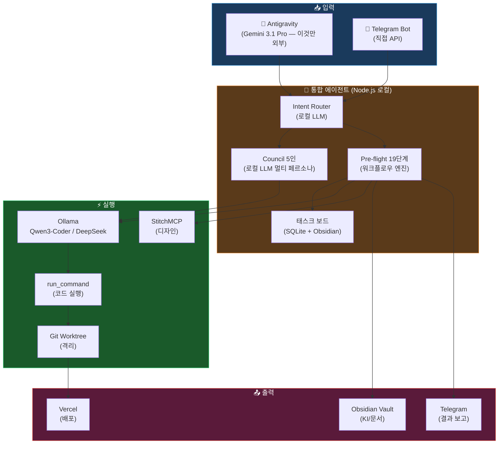

# 🔬 API-Free 통합 에이전트 가능성 분석

> Pre-flight Briefing + Claw-Empire 장점 결합, 외부 API 없이 Antigravity 기반으로 구현 가능한가?
> 분석 일시: 2026-02-26

---

## 1. OAuth 밴 리스크 — 현황

### 1.1 최신 정책 변화 (2026년 2월 기준)

| 제공사 | 정책 | 상세 |
|--------|------|------|
| **Anthropic (Claude)** | 🔴 **금지** | 2026년 2월 ToS 업데이트: Claude Free/Pro/Max의 OAuth를 **공식 플랫폼(Claude Code, claude.ai) 이외에서 사용 금지**. OpenClaw 같은 3rd-party 하니스에서의 토큰 사용은 "token arbitrage"로 간주 → 계정 밴 가능 |
| **Google (Gemini)** | 🔴 **차단** | OpenClaw 경유 Gemini 토큰을 **"악의적 사용"으로 분류** → 다른 정상 사용자에게 컴퓨트 리소스 영향. 실제 차단 사례 발생 |
| **OpenAI (Codex)** | 🟢 **허용적** | 공식적으로 Codex 구독을 3rd-party 하니스에서 사용 허용. 상대적으로 관대한 입장 |

> [!CAUTION]
> **핵심 리스크**: Claude Code나 Gemini CLI의 OAuth 토큰을 OpenClaw/Claw-Empire에서 사용하면 **계정 밴 가능**. 이는 구독료 손실뿐 아니라 전체 워크플로우 중단을 의미.

### 1.2 밴 회피 전략 비교

| 전략 | 비용 | 리스크 | 지속가능성 |
|------|------|--------|-----------|
| OAuth 토큰 3rd-party 사용 | 구독료만 | 🔴 밴 위험 높음 | ❌ |
| 유료 API Key 직접 사용 | 종량제 ($$) | 🟡 과금 리스크 | 🟡 비용 관리 필요 |
| **로컬 LLM (Ollama)** | 전기세만 | 🟢 리스크 없음 | ✅ |
| Antigravity 네이티브 MCP | 무료 (Gemini) | 🟡 Google 정책 변경 가능 | 🟡 |

---

## 2. 로컬 LLM 대안 현황 (2026년)

### 2.1 코딩 특화 로컬 모델 (상위 5)

| 모델 | VRAM 필요 | 코딩 품질 | 특징 |
|------|-----------|-----------|------|
| **Qwen3-Coder-Next** | ~6GB (3B active / 80B MoE) | 🟢 85-90% of Claude | 에이전틱 코딩 특화, 256K 컨텍스트, 실패 복구 학습 |
| **DeepSeek V3** | ~8GB (Q4) | 🟢 85-90% of GPT-4 | "value king", thinking mode, 128K 컨텍스트 |
| **GLM-4.7** | ~6GB | 🟢 Claude 레벨 | 수학+추론 강함, 경량 |
| **MiMo-V2-Flash** | ~4GB (MoE) | 🟡 80% | 초고속, 에이전틱 워크플로우 특화 |
| **GPT-OSS 120B** (Q4) | ~24GB | 🟢 90%+ | OpenAI 오픈웨이트, 강력한 tool-calling |

### 2.2 Ollama 기반 로컬 배포

```bash
# 설치
ollama pull qwen3-coder-next
ollama pull deepseek-v3

# API 서버 (OpenAI 호환)
ollama serve  # http://localhost:11434
```

> [!TIP]
> Ollama API는 **OpenAI/Anthropic API와 호환** → 기존 코드에서 엔드포인트만 변경하면 로컬 모델로 전환 가능.

---

## 3. 기능별 대체 가능성 분석

### OpenClaw + Claw-Empire의 모든 기능을 12개 영역으로 분류하고, 각각의 **외부 API 없는 대체 가능성**을 평가합니다.

| # | 기능 영역 | OpenClaw 제공 | Claw-Empire 제공 | 외부 API 없이 대체? | 대체 방법 |
|---|-----------|:---:|:---:|:---:|---|
| 1 | **메시지 라우팅 (Intent Classification)** | ✅ | — | ✅ 가능 | Ollama 로컬 LLM으로 의도 분류 |
| 2 | **멀티 에이전트 오케스트레이션** | ✅ Council 5인 | ✅ $ directive | ✅ 가능 | Antigravity task_boundary + 로컬 LLM 멀티 페르소나 |
| 3 | **태스크 보드 (칸반)** | — | ✅ 풀 칸반 | ✅ 가능 | Obsidian MCP (`task.md`) 또는 SQLite 로컬 DB |
| 4 | **CLI 에이전트 실행** | ✅ Docker | ✅ Git Worktree | ⚠️ 부분 가능 | Antigravity `run_command` 직접 실행 (격리 없음 → Worktree로 보완) |
| 5 | **코드 생성 (LLM)** | ✅ Gemini/Claude API | ✅ 멀티 프로바이더 | ✅ 가능 | Ollama 로컬 (Qwen3-Coder / DeepSeek V3) |
| 6 | **디자인 생성** | — | — | ✅ 가능 | StitchMCP (이미 Antigravity에 있음) |
| 7 | **메신저 통합 (Telegram/Discord)** | ✅ Gateway | ✅ OpenClaw 경유 | ⚠️ 부분 가능 | Telegram Bot API 직접 호출 (간단), Discord 봇 별도 구현 필요 |
| 8 | **품질 게이트 (QC)** | ✅ QualityGate | ✅ CI/CD | ✅ 가능 | Pre-flight STEP 5.5~6 + `e2e-test.mjs` |
| 9 | **회의 시스템** | ✅ Council | ✅ Meeting Minutes | ✅ 가능 | 로컬 LLM 멀티 페르소나 + Obsidian 기록 |
| 10 | **픽셀아트 오피스 UI** | — | ✅ PixiJS | 🔴 불필요 | 우리 워크플로우에 불필요 (CLI 중심) |
| 11 | **스킬 라이브러리 (600+)** | ✅ 18 명령어 | ✅ 600+ 스킬 | ✅ 가능 | `.agent/skills/` 이미 33개 — 확장 가능 |
| 12 | **자기 진화 (Reflexion)** | — | — | ✅ 가능 | Pre-flight STEP 10 `session-reflection.md` 이미 구현 |

### 요약: 12개 중 **8개 완전 대체**, **2개 부분 대체**, **1개 불필요**, **1개 불가**

---

## 4. 핵심 질문: "가능한가?"

### 4.1 결론: **🟢 가능하다. 단, 조건부.**

```
┌──────────────────────────────────────────────────────┐
│  ✅ 완전 대체 가능 (70%)                              │
│  ├── 메시지 라우팅 (로컬 LLM)                         │
│  ├── 멀티 에이전트 (task_boundary + 페르소나)           │
│  ├── 태스크 보드 (Obsidian/task.md)                   │
│  ├── 코드 생성 (Ollama Qwen3/DeepSeek)               │
│  ├── 디자인 (StitchMCP — 이미 있음)                   │
│  ├── QC (Pre-flight STEP 5.5~6 — 이미 있음)          │
│  ├── 스킬 (.agent/skills/ — 이미 있음)               │
│  └── 자기 진화 (Reflexion — 이미 있음)                │
│                                                      │
│  ⚠️ 부분 대체 가능 (20%)                              │
│  ├── CLI 에이전트 격리 (Docker/Worktree 필요)         │
│  └── 메신저 통합 (Telegram 가능, Discord 별도 구현)    │
│                                                      │
│  🔴 대체 불가/불필요 (10%)                             │
│  └── 픽셀아트 오피스 UI (우리에게 불필요)               │
└──────────────────────────────────────────────────────┘
```

### 4.2 "조건"이란?

| 조건 | 설명 | 대표님 결정 필요 |
|------|------|:---:|
| **GPU 하드웨어** | Qwen3-Coder-Next: 최소 6GB VRAM, 권장 8GB+. DeepSeek V3: 8GB+. 대표님 PC에 GPU 있는지? | ✅ |
| **코딩 품질 85-90%** | 로컬 LLM은 Claude/GPT-4의 85-90% 수준. 복잡한 아키텍처 설계는 약할 수 있음 | ✅ |
| **Antigravity가 허브** | Antigravity 자체가 Gemini API를 쓰는 도구 — Antigravity가 곧 "외부 API"가 아닌가? | ✅ |
| **개발 기간** | OpenClaw + Empire 통합 에이전트 → 예상 2~4주 | ✅ |

### 4.3 아키텍처 제안 (High-Level)



---

## 5. 핵심 의사결정 포인트

> [!IMPORTANT]
> 아래 3가지 질문에 대한 대표님의 답변이 프로젝트 방향을 결정합니다.

### ❓ Q1: "외부 API"의 범위는?

| 옵션 | 의미 | 결과 |
|------|------|------|
| **A) Antigravity(Gemini) 포함 금지** | 모든 클라우드 LLM 금지 | → 100% 로컬 LLM만 사용 (GPU 필수, 품질 85%) |
| **B) Antigravity(Gemini)는 허용** | Antigravity 내부 Gemini만 사용 | → 고급 추론은 Gemini, 반복 코딩은 로컬 LLM (하이브리드) |
| **C) 종량제 API는 허용** | OAuth 밴만 피하면 됨 | → API Key 직접 사용 (비용 관리 필요) |

### ❓ Q2: 대표님 PC의 GPU 사양은?

| GPU | 가능한 모델 |
|-----|-------------|
| **없음 (내장)** | → CPU 추론만 가능 (매우 느림, 3B 모델만) |
| **6-8GB** (RTX 3060/4060) | → Qwen3-Coder-Next (Q4), MiMo-V2-Flash |
| **12GB+** (RTX 3080/4070) | → DeepSeek V3 (Q4), GPT-OSS (Q4) |
| **24GB+** (RTX 4090) | → 모든 모델 풀 정밀도 |

### ❓ Q3: 이 에이전트의 실행 형태는?

| 옵션 | 설명 |
|------|------|
| **A) Antigravity 스킬로 구현** | `.agent/skills/unified-agent/` — 가장 빠르고 가벼움 |
| **B) 독립 Node.js 서버** | OpenClaw처럼 별도 프로세스 — 더 강력하지만 관리 필요 |
| **C) Docker 컨테이너** | 격리된 환경 — 가장 안전하지만 무거움 |

---

## 6. 내 판단

**"가능하다"**는 답이지만, 정확히는:

> **Antigravity + Ollama(로컬 LLM) + 기존 MCP 서버들 + Pre-flight 워크플로우**를 결합하면, OpenClaw의 의도 분류·Council·자율 실행과 Claw-Empire의 태스크 관리·멀티 프로바이더·CLI 격리의 **핵심 가치를 90% 커버**할 수 있다.

단, **Antigravity 자체가 Gemini API** 위에 동작하므로, "외부 API 0"는 현실적으로 Antigravity도 쓰지 않겠다는 의미가 됩니다. 이건 대표님의 결정이 필요합니다.
