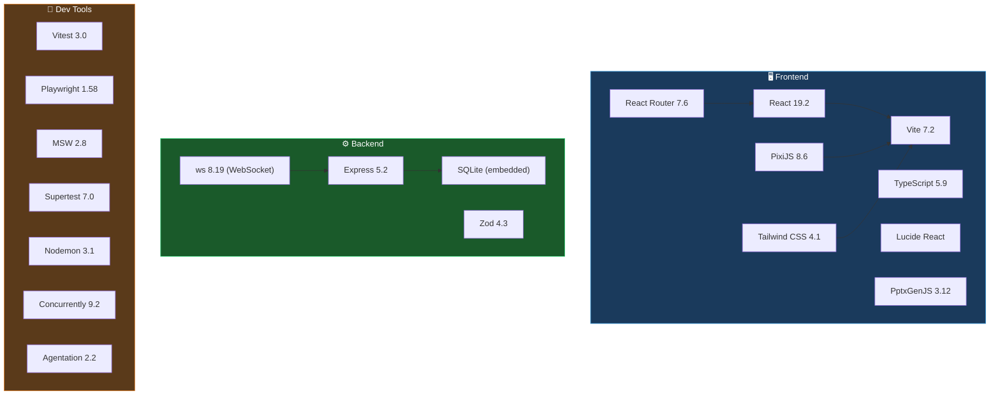
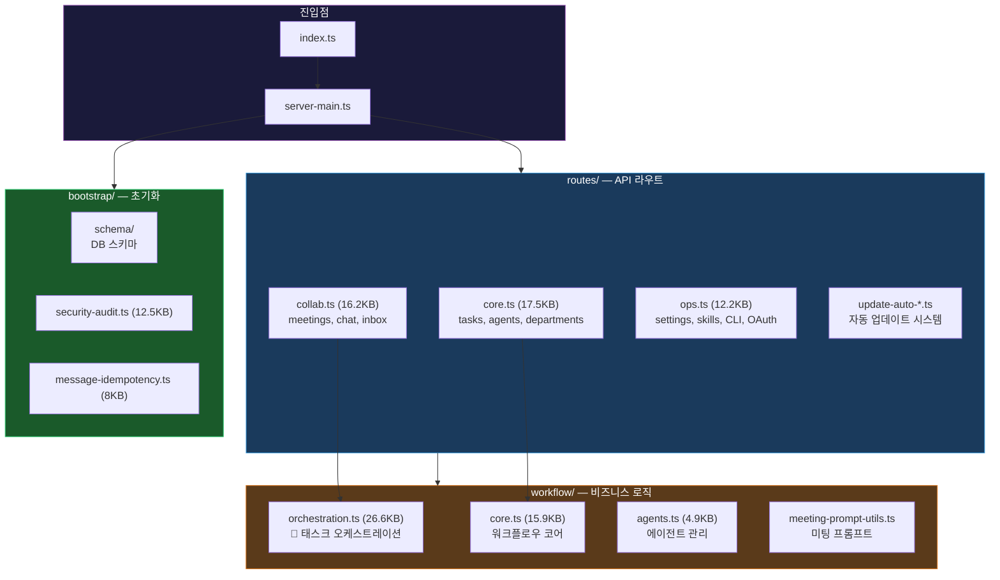
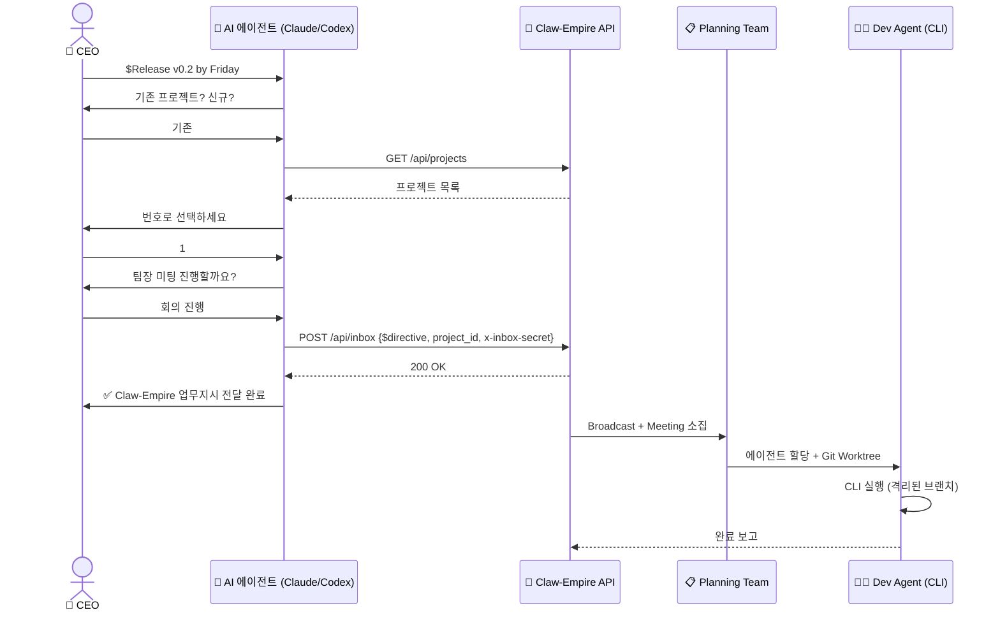
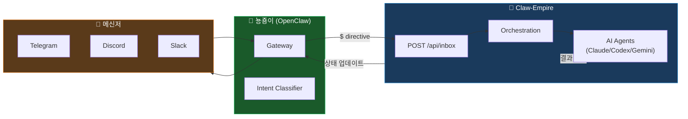

# 🏢 Claw-Empire 프로젝트 철저 분석

> 분석 대상: [E:\Agent\claw-empire\claw-empire](file:///E:/Agent/claw-empire/claw-empire)
> 분석 일시: 2026-02-26
> 버전: v1.2.0 (package.json: 1.1.9)

---

## 1. 프로젝트 정의

**Claw-Empire**는 AI 코딩 에이전트(Claude Code, Codex CLI, Gemini CLI, OpenCode, Copilot, Antigravity)를 **가상 소프트웨어 회사**로 시뮬레이션하는 **로컬-퍼스트** 오피스 시뮬레이터.

| 항목 | 내용 |
|------|------|
| **포지셔닝** | CEO가 AI 에이전트 직원들을 관리하는 픽셀아트 오피스 |
| **핵심 가치** | One interface for many AI agents, local-first & private |
| **라이선스** | Apache 2.0 |
| **원작자** | GreenSheep01201 |

---

## 2. 기술 스택 분석

### 2.1 의존성 트리



### 2.2 주요 기술 선택 평가

| 기술 | 버전 | 평가 |
|------|------|------|
| React 19 | 최신 | ✅ Concurrent rendering, Server Components 지원 |
| Vite 7 | 최신 | ✅ 빠른 HMR, ESM 네이티브 |
| Express 5 | 최신 | ✅ async 미들웨어 네이티브 지원 |
| PixiJS 8 | 최신 | ✅ WebGPU 지원, 픽셀아트에 적합 |
| Tailwind CSS 4 | 최신 | ✅ Lightning CSS, 새로운 설정 포맷 |
| TypeScript 5.9 | 최신 | ✅ JIT 타입 체크 |
| Zod 4 | 최신 | ✅ 런타임 검증 |
| SQLite | embedded | ✅ 설치 무설정, 로컬 퍼스트 |

> [!TIP]
> 전체적으로 **2026년 최신 스택**을 공격적으로 채택. Node.js 22+ 필수, pnpm 사용.

---

## 3. 아키텍처 구조

### 3.1 전체 디렉토리 맵

```
claw-empire/
├── server/                          # ⚙️ 백엔드 (Express 5 + SQLite)
│   ├── index.ts                     # 진입점 (28B — server-main으로 위임)
│   ├── server-main.ts               # 런타임 부트스트랩 (4.5KB)
│   ├── modules/
│   │   ├── routes/                  # API 라우트 핸들러
│   │   │   ├── core/                #   핵심 CRUD (tasks, agents, departments)
│   │   │   ├── core.ts              #   (17.5KB)
│   │   │   ├── collab/              #   협업 (meetings, chat, inbox)
│   │   │   ├── collab.ts            #   (16.2KB)
│   │   │   ├── ops/                 #   운영 (settings, skills, CLI, OAuth)
│   │   │   ├── ops.ts               #   (12.2KB)
│   │   │   ├── shared/              #   공용 유틸
│   │   │   └── update-auto-*.ts     #   자동 업데이트 시스템
│   │   ├── workflow/                # 비즈니스 로직
│   │   │   ├── orchestration.ts     #   🔑 핵심: 태스크 오케스트레이션 (26.6KB)
│   │   │   ├── core.ts              #   워크플로우 코어 (15.9KB)
│   │   │   ├── agents.ts            #   에이전트 관리 (4.9KB)
│   │   │   └── meeting-prompt-*     #   미팅 프롬프트 유틸
│   │   ├── bootstrap/               # 초기화
│   │   │   ├── schema/              #   DB 스키마 정의
│   │   │   ├── security-audit.ts    #   보안 감사 (12.5KB)
│   │   │   └── message-idempotency.ts # 메시지 중복 방지 (8KB)
│   │   └── lifecycle/               # 라이프사이클
│   │       └── register-graceful-shutdown.ts
│   ├── gateway/                     # OpenClaw 게이트웨이 (Telegram/Discord/Slack)
│   ├── oauth/                       # OAuth 처리 (GitHub, Google)
│   ├── security/                    # 보안 미들웨어
│   ├── ws/                          # WebSocket 서버
│   └── db/                          # SQLite 커넥션
│
├── src/                             # 🖥️ 프론트엔드 (React 19 + PixiJS)
│   ├── App.tsx                      # 🚨 89.5KB — 매우 큰 단일 파일
│   ├── index.css                    # 🚨 75.4KB — 매우 큰 CSS
│   ├── components/                  # UI 컴포넌트 (23파일 + 13서브폴더)
│   │   ├── OfficeView.tsx           #   픽셀아트 오피스 (13KB)
│   │   ├── TaskBoard.tsx            #   칸반 보드 (12.6KB)
│   │   ├── ChatPanel.tsx            #   CEO 채팅 (17.3KB)
│   │   ├── Dashboard.tsx            #   대시보드 (9KB)
│   │   ├── TerminalPanel.tsx        #   터미널 로그 (20.2KB)
│   │   ├── SettingsPanel.tsx        #   설정 (15.4KB)
│   │   ├── DecisionInboxModal.tsx   #   의사결정 인박스 (22.2KB)
│   │   ├── AgentManager.tsx         #   에이전트 관리 (15.1KB)
│   │   └── ...                      #   +15개 더
│   ├── api/                         # 프론트엔드 API 모듈
│   ├── hooks/                       # React 훅 (polling, WebSocket)
│   ├── types/                       # 타입 정의
│   └── i18n.ts                      # 다국어 (EN/KO/JA/ZH)
│
├── tests/e2e/                       # 🧪 E2E 테스트 (Playwright)
│   ├── smoke.spec.ts                #   기본 스모크 (198B)
│   ├── ci-coverage-gap.spec.ts      #   CI 커버리지 갭 (17KB)
│   └── ci-manual-assignment.spec.ts #   수동 할당 (9.8KB)
│
├── tools/                           # 🔧 보조 도구
│   ├── taste-skill/                 #   기본 스킬 파일
│   ├── ppt_team_agent/              #   PPT 생성 에이전트
│   └── playwright-mcp/              #   Playwright MCP 연동
│
├── scripts/                         # 📜 스크립트 (13개)
│   ├── setup.mjs                    #   환경 설정
│   ├── openclaw-setup.*             #   OpenClaw 통합 설정
│   ├── generate-architecture-report.mjs # 아키텍처 보고서 생성
│   └── qa/                          #   QA 스크립트 모음
│
├── docs/                            # 📖 문서
│   ├── DESIGN.md                    #   UI/UX 디자인 가이드
│   ├── architecture/                #   아키텍처 다이어그램
│   ├── releases/                    #   릴리스 노트
│   └── plans/                       #   계획 문서
│
└── AGENTS.md                        # 🤖 AI 오케스트레이션 규칙 (485줄)
```

### 3.2 백엔드 모듈 계층



---

## 4. AGENTS.md 오케스트레이션 시스템

### 4.1 명령어 체계

| 접두사 | 용도 | 동작 |
|--------|------|------|
| **`$`** | CEO 디렉티브 | 프로젝트 선택 → 미팅 여부 → inbox API → 태스크 생성 + 배포 |
| **`#`** | 태스크 등록 | AI가 직접 실행 안 함 → 보드 등록 → 에이전트 할당 → CLI 실행 |
| (없음) | 일반 대화 | 일반 공지로 처리 |

### 4.2 `$` 디렉티브 플로우



### 4.3 보안 메커니즘

| 보안 항목 | 구현 방식 |
|-----------|-----------|
| **Inbox 인증** | `INBOX_WEBHOOK_SECRET` + `x-inbox-secret` 헤더 매칭 |
| **OAuth 토큰** | AES-256-GCM 암호화, SQLite 서버사이드 저장 |
| **API 인증** | `API_AUTH_TOKEN` Bearer 토큰 (비-localhost 접근) |
| **Git 안전** | 에이전트 커밋 금지 → 테스트 통과 → CEO 승인 후에만 |
| **Worktree 격리** | 각 에이전트가 격리된 Git Worktree에서 작업 |
| **자동 업데이트** | restart command에 쉘 메타캐릭터/인터프리터 차단 |

---

## 5. 프론트엔드 분석

### 5.1 컴포넌트 크기 분포 (상위 10)

| 파일 | 크기 | 역할 |
|------|------|------|
| [App.tsx](file:///E:/Agent/claw-empire/claw-empire/src/App.tsx) | **89.5KB** | 🚨 앱 셸 + 전체 상태 |
| [index.css](file:///E:/Agent/claw-empire/claw-empire/src/index.css) | **75.4KB** | 🚨 전체 스타일시트 |
| [DecisionInboxModal.tsx](file:///E:/Agent/claw-empire/claw-empire/src/components/DecisionInboxModal.tsx) | 22.2KB | 의사결정 인박스 |
| [AgentStatusPanel.tsx](file:///E:/Agent/claw-empire/claw-empire/src/components/AgentStatusPanel.tsx) | 21.6KB | 에이전트 상태 |
| [TerminalPanel.tsx](file:///E:/Agent/claw-empire/claw-empire/src/components/TerminalPanel.tsx) | 20.2KB | 터미널 패널 |
| [ProjectManagerModal.tsx](file:///E:/Agent/claw-empire/claw-empire/src/components/ProjectManagerModal.tsx) | 19.2KB | 프로젝트 관리 |
| [TaskReportPopup.tsx](file:///E:/Agent/claw-empire/claw-empire/src/components/TaskReportPopup.tsx) | 18.7KB | 태스크 리포트 |
| [SkillHistoryPanel.tsx](file:///E:/Agent/claw-empire/claw-empire/src/components/SkillHistoryPanel.tsx) | 17.9KB | 스킬 히스토리 |
| [ChatPanel.tsx](file:///E:/Agent/claw-empire/claw-empire/src/components/ChatPanel.tsx) | 17.3KB | 채팅 패널 |
| [AgentManager.tsx](file:///E:/Agent/claw-empire/claw-empire/src/components/AgentManager.tsx) | 15.1KB | 에이전트 관리 |

> [!WARNING]
> **`App.tsx` 89.5KB**는 단일 파일로는 매우 크다. React 앱에서 이 크기는 통상 **상태 관리 + 라우팅 + 레이아웃**이 한 파일에 몰린 패턴. `src/app/` 디렉토리로 분리 진행 중인 것으로 보임.

### 5.2 디자인 시스템

- **테마**: "Cute but Efficient Empire" — 다크 글래시 배경 + 픽셀아트
- **컬러**: `empire-900`(#0f172a) ~ `empire-300`(#cbd5e1) 커스텀 팔레트
- **애니메이션**: `agent-bounce`, `kpi-pop`, `sparkle-spin`, `shimmer`, `xp-shine`
- **아이콘**: Lucide React
- **폰트**: 시스템 폰트 스택 ('Segoe UI', system-ui)
- **레이아웃**: Shell Layout (사이드바 + 헤더 + 컨텐츠)

---

## 6. 테스트 전략

### 6.1 테스트 계층

| 계층 | 도구 | 스크립트 | 대상 |
|------|------|----------|------|
| **프론트엔드 단위** | Vitest + Testing Library + MSW | `pnpm test:web` | 컴포넌트, API 모듈, 훅 |
| **백엔드 단위** | Vitest + Supertest | `pnpm test:api` | 라우트, 워크플로우 |
| **E2E** | Playwright | `pnpm test:e2e` | 3개 spec (스모크, CI 커버리지 갭, 수동 할당) |
| **통신 QA** | 커스텀 Node.js 스크립트 | `pnpm test:comm:suite` | LLM/OAuth/API 통신 |
| **오피스 QA** | 커스텀 스크립트 | `pnpm test:qa:office:*` | 콘솔 스모크, 성능, 해상도, 테마 |
| **CI** | GitHub Actions | `.github/workflows/ci.yml` | format + lint + test:web + test:api + test:e2e |

### 6.2 CI 파이프라인

```
PR → Unicode Guard → pnpm install → format:check → lint → Playwright install → test:ci
                                                                                   ├── test:web --coverage
                                                                                   ├── test:api --coverage
                                                                                   └── test:e2e
```

---

## 7. OpenClaw 통합 (핵심 연동)

### 7.1 통합 포인트

| 연동 | 방향 | 메커니즘 |
|------|------|----------|
| **Telegram/Discord/Slack → Claw-Empire** | Inbound | OpenClaw Gateway → `POST /api/inbox` |
| **Claw-Empire → OpenClaw** | Outbound | `OPENCLAW_CONFIG` 경로로 세션 디스커버리 |
| **CEO 디렉티브 ($)** | Bidirectional | 메신저 → OpenClaw → Claw-Empire → 에이전트 실행 |
| **AGENTS.md 주입** | Setup | `pnpm setup` → AI 에이전트 규칙 주입 |

### 7.2 뇽죵이(OpenClaw) ↔ Claw-Empire 관계



---

## 8. 강점 분석

### ✅ 8.1 완성도 높은 제품

- **600+ 스킬 라이브러리**, 커스텀 스킬 업로드, PPT 생성, Git Worktree 격리
- 4개 언어(EN/KO/JA/ZH) i18n, 자동감지
- 자동 업데이트 시스템 (safe-mode, channel-based, restart policy)
- PR 템플릿 + CI + 보안 감사 + 프리플라이트 체크

### ✅ 8.2 보안 설계

- OAuth 토큰 AES-256-GCM 암호화 (SQLite 서버사이드)
- Inbox webhook secret 인증
- Git Worktree 격리 (에이전트별 독립 브랜치)
- 자동 업데이트 restart command에 쉘 인젝션 차단

### ✅ 8.3 멀티-프로바이더 통합

- CLI (Claude Code, Codex, Gemini CLI, OpenCode)
- OAuth (GitHub, Google)
- API (OpenAI, Anthropic, Google, Ollama, OpenRouter, Together, Groq, Cerebras, Custom)
- 모든 프로바이더를 하나의 대시보드에서 관리

### ✅ 8.4 코드 모듈화 진행 중

- v1.2.0에서 `src/components/*`, `server/modules/routes/*`, `server/modules/workflow/*`로 분리
- `@ts-nocheck` 제거, 타입 안전성 강화
- Prettier 포맷팅 표준화

---

## 9. 약점 및 리스크 분석

### ⚠️ 9.1 `App.tsx` 89.5KB — God Component 문제

| 지표 | 값 | 권장 |
|------|----|------|
| 파일 크기 | 89.5KB | < 10KB |
| 예상 줄 수 | ~2,500줄 | < 300줄 |

`src/app/` 디렉토리가 존재하지만 분리가 아직 완료되지 않은 것으로 보임.

### ⚠️ 9.2 `index.css` 75.4KB — 모노리스 스타일시트

Tailwind CSS 4를 사용하면서도 75KB의 커스텀 CSS가 존재. Tailwind 유틸리티 클래스와 커스텀 CSS가 혼재할 가능성.

### ⚠️ 9.3 E2E 테스트 커버리지 제한적

- 3개 spec 파일 (smoke 198B, coverage-gap 17KB, manual-assignment 9.8KB)
- **핵심 워크플로우**($ directive → 미팅 → 에이전트 실행)에 대한 E2E가 보이지 않음
- 통신 QA(`test:comm:*`)가 별도 커스텀 스크립트로 분리 — Playwright와 통합되지 않음

### ⚠️ 9.4 `orchestration.ts` 26.6KB — 복잡도 집중

오케스트레이션 로직이 단일 파일에 집중. 미팅 소집, 에이전트 선택, 태스크 배분, CLI 실행이 한 파일.

### ⚠️ 9.5 버전 불일치

- README: v1.2.0
- package.json: 1.1.9
- 릴리스 노트 경로: `docs/releases/v1.2.0.md`

### ⚠️ 9.6 pnpm + Node 22 필수 — 진입 장벽

npm/yarn 사용자는 별도 마이그레이션 필요. Node 22는 2026년 기준 LTS이지만, 일부 환경에서 22+ 미지원.

---

## 10. Pre-flight Briefing과의 비교 분석

### 10.1 아키텍처 패턴 비교

| 패턴 | Pre-flight Briefing | Claw-Empire |
|------|---------------------|-------------|
| **파이프라인** | 19단계 선형 + 게이트 | $ directive → 미팅 → 에이전트 할당 → 실행 |
| **게이트 타입** | Auto / Soft / Hard 3티어 | Binary (미팅 O/X) |
| **인간 감독** | 5개 Hard Gate | CEO 디렉티브 자체가 감독 |
| **자동화 수준** | STEP 5~8.5 연속 자동 | CLI 에이전트 완전 자율 (Worktree 격리) |
| **에이전트 수** | 1 (Antigravity) 또는 뇽죵이 | 다수 (멀티 에이전트 + 멀티 프로바이더) |
| **피드백 루프** | STEP 10 Reflexion | Git Worktree merge 승인 |
| **실패 복구** | 반려 테이블 | 에이전트 재할당 또는 사용자 보고 |

### 10.2 통합 가능성

| 연동 포인트 | 방법 | 가치 |
|-------------|------|------|
| **Pre-flight → Claw-Empire** | STEP 5에서 `$ directive`로 태스크 전달 | 뇽죵이 대신 Claw-Empire가 에이전트 실행 |
| **Claw-Empire → Pre-flight** | 실행 결과를 Pre-flight STEP 9 보고에 반영 | 멀티 에이전트 결과를 단일 리뷰로 |
| **공유 컴포넌트** | AGENTS.md 오케스트레이션 규칙 | Pre-flight의 `INSTRUNCTION.md`가 AGENTS.md와 유사 |

---

## 11. 전체 건강도 평가

| 영역 | 점수 | 평가 |
|------|------|------|
| **기능 완성도** | 🟢 9/10 | 600+ 스킬, PPT 생성, 멀티 프로바이더, i18n 4언어 |
| **기술 스택** | 🟢 9/10 | 2026년 최신 스택 공격적 채택 |
| **보안** | 🟢 8/10 | AES-256-GCM, webhook secret, git safety, 쉘 인젝션 차단 |
| **테스트** | 🟡 6/10 | 단위 테스트 충실하나 E2E 3개로 제한적 |
| **코드 구조** | 🟡 6/10 | App.tsx 89KB, index.css 75KB, orchestration.ts 27KB — God File 문제 |
| **문서** | 🟢 8/10 | README 4언어, DESIGN.md, architecture 다이어그램, 릴리스 노트 |
| **CI/CD** | 🟢 8/10 | GitHub Actions + format/lint/test/e2e, 자동 업데이트 시스템 |
| **확장성** | 🟢 8/10 | 프로바이더 추가 용이, 스킬 업로드 시스템, OpenClaw 게이트웨이 |

### 종합: **🟢 7.8/10** — 완성도 높은 오픈소스 AI 에이전트 오케스트레이터

> 기능적으로는 매우 완성도가 높지만, 코드 구조(God Files)와 E2E 테스트 커버리지가 개선 필요. Pre-flight Briefing과의 통합 가능성이 높으며, 특히 뇽죵이 위임 메커니즘(STEP 5~8)의 대안으로 활용 가능.
