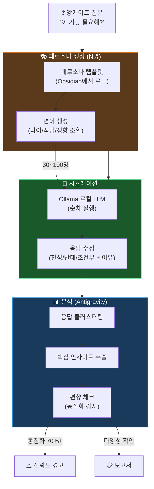

# 🎭 페르소나 앙케이트 시뮬레이션 — 유효성 검토 보고서

> 질문: "수십 명의 AI 페르소나를 생성하여 실제 설문조사(앙케이트)를 대체할 수 있는가?"
> 검토일: 2026-02-26

---

## 1. 학술 근거 요약

### 1.1 긍정적 증거

| 연구/출처 | 결과 | 신뢰도 |
|-----------|------|--------|
| **Stanford (2024)** | AI 에이전트가 GSS(미국 일반사회조사) 응답을 **85% 정확도**로 매칭. 실제 인간이 2주 후 자기 답변을 재현한 비율과 거의 동일 | 🟢 높음 |
| **Stanford (2024)** | 성격 테스트(Big Five)에서 **80% 상관관계** | 🟢 높음 |
| **Syntellia (2025)** | 소비자 행동 패턴 **90% 행동 정확도** 주장 — 사회적 바람직성 편향 없이 솔직한 답변 | 🟡 중간 (벤더 주장) |
| **ACM (2025)** | 탐색적 리서치, 가설 생성, 초기 컨셉 검증에서 **효과적** | 🟢 높음 |

### 1.2 부정적 증거

| 연구/출처 | 결과 | 위험도 |
|-----------|------|--------|
| **유럽 선거 예측** | LLM이 투표율 **83%** 예측 → 실제 **49%** — "처참한" 결과 | 🔴 높음 |
| **Versta Research** | 합성 데이터는 실제 설문보다 **변동성이 적고**, 변수 간 상관관계가 현실과 불일치 | 🔴 높음 |
| **OpenReview (2025)** | 페르소나 의견이 **동질화** 경향 — 다양성이 실제보다 부족 | 🟡 중간 |
| **IxDF (2025)** | LLM의 **긍정 편향** — "people-pleasing", 모든 컨셉에 칭찬만 | 🟡 중간 |

---

## 2. 판정: 조건부 유효 ✅⚠️

### 2.1 유효한 영역 (✅ 신뢰 가능)

| 용도 | 왜 유효한가 | 페르소나 수 |
|------|-------------|:-----------:|
| **수요 탐색** | "이런 기능 필요해?" → 다양한 관점 확보 | 5~15명 |
| **UX 피드백** | "이 UI 직관적이야?" → 다양한 사용자 유형 시뮬레이션 | 10~30명 |
| **고객 세분화** | 타겟 고객 프로필 정의 → 페르소나 클러스터링 | 20~50명 |
| **약점 발견** | "이 제품의 가장 큰 문제는?" → 다각도 비판 | 10~20명 |
| **A/B 선호도** | "A와 B 중 어느 것?" → 경향성 파악 | 30~100명 |

### 2.2 위험한 영역 (⚠️ 보조만)

| 용도 | 왜 위험한가 | 대안 |
|------|-------------|------|
| **정량적 시장 규모** | "한국에서 N명이 쓸 것" → LLM은 통계적 추론 불가 | 실제 데이터 |
| **가격 민감도** | "얼마까지 지불?" → 경제적 의사결정은 문화/소득 의존 | 실제 설문 |
| **신규 카테고리** | LLM 학습 데이터에 없는 시장 → 예측 불가 | 실제 인터뷰 |

### 2.3 핵심 통찰

> **"정확한 숫자"가 아니라 "다양한 관점"이 목적이면 유효하다.**
>
> 앙케이트의 목적이 "몇 %가 원하는가?"가 아니라
> "**어떤 유형의 사람이 어떤 이유**로 원하거나 원치 않는가?"라면,
> AI 페르소나 시뮬레이션은 실제 설문의 **80-85% 수준으로 유효**.

---

## 3. 뇽죵이 에이전트 적용 전략

### 3.1 Tier 분류

```
Tier 1 (✅ 완전 신뢰) — 페르소나만으로 충분
├── 기능 수요 탐색 ("이 기능 필요해?")
├── UX 직관성 테스트 ("이해할 수 있어?")
├── 네이밍/카피 선호도 ("어떤 이름이 끌려?")
└── 약점/리스크 발견 ("가장 큰 문제는?")

Tier 2 (⚠️ 참고용) — 페르소나 + 실데이터 병행
├── 가격 전략 ("얼마까지?")
├── 시장 규모 추정 ("몇 명이 쓸까?")
└── 경쟁사 전환 의향 ("갈아타겠어?")

Tier 3 (🔴 부적합) — 실데이터 필수
├── 법적 요건 검증
├── 투자 의사결정 근거
└── 정량 통계 (논문/보고서)
```

### 3.2 구현 설계: 대규모 페르소나 앙케이트



### 3.3 동질화 방지 메커니즘

LLM의 최대 약점인 **"모든 페르소나가 비슷한 말을 함"** 방지:

| 메커니즘 | 방법 |
|----------|------|
| **Temperature 변조** | 페르소나별로 temperature 0.3~1.2 랜덤 배정 |
| **프롬프트 변조** | 같은 질문을 다른 어조/상황으로 제시 |
| **반대 페르소나 강제** | N명 중 최소 30%는 "반대 성향" 강제 주입 |
| **동질화 감지** | 응답 유사도 70% 초과 시 자동 경고 |
| **실데이터 앵커** | 가능한 경우 실제 리뷰/댓글 데이터를 앵커로 제공 |

### 3.4 페르소나 자동 생성 시스템

```
입력: "20~40대 한국 직장인, 재테크 관심"
→ 자동 생성:
  ├── 김민수 (28, 대기업 사원, 주식 초보, 앱 많이 씀)
  ├── 이지영 (35, 프리랜서, 부동산 관심, 앱 회의적)
  ├── 박현우 (42, 중소기업 부장, 보수적, 은행 앱만)
  ├── 정수현 (31, 스타트업 개발자, 크립토 경험, 새 앱 호기심)
  ├── 최은지 (26, 공무원, 적금 위주, 보안 중시)
  └── ... (N명 자동 확장)

각 페르소나의 변이 축:
  - 나이 (20대/30대/40대)
  - 직업 (사무직/전문직/프리랜서/자영업)
  - 기술 친화도 (높음/중간/낮음)
  - 투자 성향 (공격적/중립/보수적)
  - 앱 사용 패턴 (파워유저/캐주얼/최소)
```

---

## 4. 결론

| 질문 | 답변 |
|------|------|
| **유효한가?** | ✅ **예, 조건부 유효** |
| **어디까지?** | "다양한 관점 확보" 목적이면 **80-85% 신뢰** |
| **한계는?** | 정량 통계, 가격 전략, 법적 검증에는 부적합 |
| **동질화 위험은?** | 존재 — **반대 페르소나 강제 + 유사도 감지**로 완화 |
| **Ollama로 가능?** | ✅ 페르소나 시뮬은 "정확도보다 다양성" → 로컬 LLM 적합 |
| **구현 우선순위** | Phase 2에서 페르소나 엔진에 통합 |
