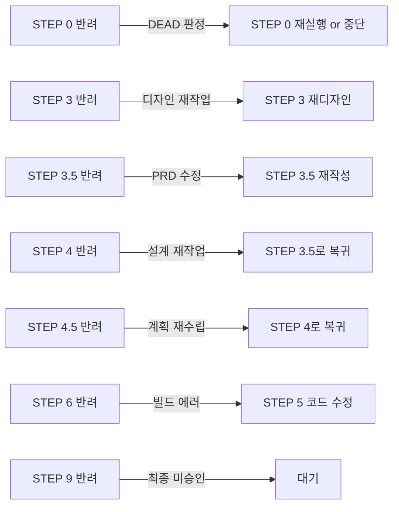

# 🔬 Pre-flight Briefing 워크플로우 철저 분석

> 분석 대상: [preflight-briefing.md](file:///C:/Users/AIcreator/.agent/workflows/preflight-briefing.md) (428줄)
> 분석 일시: 2026-02-26

---

## 1. 전체 구조 개요

### 1.1 파이프라인 아키텍처

```mermaid
flowchart TD
    subgraph IDEATION["🧪 아이디어 검증 (STEP 0~2)"]
        S0["STEP 0<br/>⛏️ PADA 아이디어 검증<br/>🔒 Hard (DEAD 시)"]
        S1["STEP 1<br/>📚 KI 조회 + 기존코드 분석<br/>⚡ Auto"]
        S15["STEP 1.5<br/>🧑‍⚕️ 페르소나 로드<br/>⚡ Auto"]
        S2["STEP 2<br/>🔍 경쟁사 벤치마크<br/>🔓 Soft Gate"]
    end

    subgraph DESIGN["🎨 설계 (STEP 3~4.5)"]
        S3["STEP 3<br/>🎨 Stitch 디자인 + 트렌드<br/>🔒 Hard Gate"]
        S35["STEP 3.5<br/>📋 PRD 작성<br/>🔒 Hard Gate"]
        S4["STEP 4<br/>🏗️ 구현 계획 + API/DB<br/>🔓 Soft Gate"]
        S45["STEP 4.5<br/>🖐️ 5인 전략검증<br/>🔒 Hard Gate"]
    end

    subgraph AUTO["🚀 자동 실행 구간 (STEP 5~8.5)"]
        S5["STEP 5<br/>👨‍💻 코드 구현"]
        S55["STEP 5.5<br/>🧪 e2e 테스트 + 3회 자동수정"]
        S6["STEP 6<br/>✅ 빌드 검증 + QC"]
        S7["STEP 7<br/>📦 Git 커밋"]
        S75["STEP 7.5<br/>🔄 CI/CD 게이트"]
        S8["STEP 8<br/>🚀 Vercel 배포"]
        S85["STEP 8.5<br/>🚀 런치 완성도 + 모니터링"]
    end

    subgraph LAUNCH["📢 런칭 (STEP 9~10)"]
        S9["STEP 9<br/>📢 대표님 최종검토<br/>🔒 Hard Gate"]
        S95["STEP 9.5<br/>🔁 사용자 피드백 수집"]
        S10["STEP 10<br/>📝 KI 업데이트"]
    end

    S0 --> S1 --> S15 --> S2
    S2 --> S3 --> S35 --> S4 --> S45
    S45 -->|"승인 후 자동"| S5 --> S55 --> S6 --> S7 --> S75 --> S8 --> S85
    S85 --> S9
    S9 --> S95 --> S10

    style IDEATION fill:#1a3a1a,stroke:#2ecc71,color:#fff
    style DESIGN fill:#1a3a5c,stroke:#3498db,color:#fff
    style AUTO fill:#5a3a1a,stroke:#e67e22,color:#fff
    style LAUNCH fill:#5a1a3a,stroke:#e74c3c,color:#fff
```



### 1.2 파이프라인 규모

| 항목 | 수치 |
|------|------|
| 총 단계 수 | 19개 (STEP 0 ~ STEP 10, 서브스텝 포함) |
| Hard Gate (대표님 승인 필수) | 5개 (STEP 0·3·3.5·4.5·9) |
| Soft Gate (보고 후 진행) | 2개 (STEP 2·4) |
| Auto Gate (자동 통과) | 12개 |
| 참조 워크플로우 파일 | 11개 |
| 참조 스킬 파일 | 8개 |
| 메인 워크플로우 줄 수 | 428줄 |
| 하위 워크플로우 총 줄 수 | ~960줄 |

---

## 2. 게이트 시스템 분석

### 2.1 3-Tier 게이트 구조

| 게이트 | 동작 원리 | 반려 시 | 적용 STEP |
|--------|-----------|---------|-----------|
| ⚡ **Auto** | AI가 자동 판단·실행 | — | 1, 1.5, 5, 5.5, 6, 7, 7.5, 8, 8.5, 9.5, 10 |
| 🔓 **Soft** | 결과 보고 → 묵시적 승인 | 해당 STEP 재실행 | 2, 4 |
| 🔒 **Hard** | 대표님 명시적 "OK" 필수 | 지정 STEP으로 복귀 | 0, 3, 3.5, 4.5, 9 |

> [!IMPORTANT]
> Hard Gate 5개가 **아이디어(1) → 디자인(1) → PRD(1) → 전략검증(1) → 최종검토(1)** 에 위치. 핵심 의사결정 포인트에 인간 감독이 집중되어 있음.

### 2.2 반려 흐름 (Rejection Flow)



> [!NOTE]
> 반려가 항상 **직전 STEP이 아니라 적절한 STEP**으로 복귀하는 점이 잘 설계됨. 예: STEP 4 반려 → STEP 3.5(PRD)로 복귀 — 구현 계획이 잘못이면 PRD부터 재검토.

---

## 3. 자동/수동 전환 메커니즘

### 3.1 실행 모드 전환표

```
┌──────────────────────────────────────────────────────────┐
│  STEP 0 ~ 4.5  │    STEP 5 ~ 8.5    │  STEP 9  │ 9.5~10│
│   🔄 수동       │    🚀 자동          │  🔄 수동  │ 🚀 자동│
│  대표님 승인 대기│  중단 없이 연속 실행 │  최종검토 │  내부  │
└──────────────────────────────────────────────────────────┘
```

### 3.2 자동 구간의 규칙

- **"진행할까요?" 금지** — 워크플로우 위반으로 명시
- STEP 4.5 승인 후 → STEP 8.5까지 중간 보고 없이 연속 실행
- 에러 발생 시에만 멈춤 (3회 자동 재시도 후 보고)
- 배포(STEP 8)는 `SafeToAutoRun=false`이므로 대표님의 Run 버튼은 필요하지만, 질문은 하지 않음

> [!TIP]
> 이 설계는 **"AI가 결정할 수 있는 건 묻지 않고 실행"** 원칙을 잘 구현. 대표님의 의사결정 피로를 5개 핵심 게이트로 한정.

---

## 4. 하위 워크플로우 생태계

### 4.1 파일별 역할 매트릭스

| STEP | 참조 파일 | 줄 수 | 핵심 기능 |
|------|-----------|-------|-----------|
| STEP 0 | [pada-step0.md](file:///C:/Users/AIcreator/.agent/workflows/pada-step0.md) | 431 | 7단계 아이디어 생사 판정 (v3.1 — FACT-FIRST + 다중 소스) |
| STEP 1.5 | [persona-loader SKILL.md](file:///C:/Users/AIcreator/.agent/skills/persona-loader/SKILL.md) | - | 도메인 전문가 페르소나 자동 로드 |
| STEP 2 | [competitive-benchmark.md](file:///C:/Users/AIcreator/.agent/workflows/competitive-benchmark.md) | 97 | 키워드 3라운드 재검토 + 3분류 보고서 |
| STEP 3 | [stitch-design-first SKILL.md](file:///C:/Users/AIcreator/.agent/skills/stitch-design-first/SKILL.md) | - | StitchMCP 디자인 퍼스트 워크플로우 |
| STEP 3.5 | [prd-template SKILL.md](file:///C:/Users/AIcreator/.agent/skills/prd-template/SKILL.md) | - | PRD 풀 스펙 템플릿 |
| STEP 4.5 | [council SKILL.md](file:///C:/Users/AIcreator/.agent/skills/council/SKILL.md) | - | 5인 Council 전략회의 |
| STEP 5.5 | [test-generator SKILL.md](file:///C:/Users/AIcreator/.agent/skills/test-generator/SKILL.md) + [e2e-test.md](file:///C:/Users/AIcreator/.agent/workflows/e2e-test.md) | 61 | AC → 테스트케이스 자동생성 |
| STEP 6 | [deployment-qc.md](file:///C:/Users/AIcreator/.agent/workflows/deployment-qc.md) | 87 | 자동수정 루프 (3회 재시도) |
| STEP 7.5 | [ci-cd-gate.md](file:///C:/Users/AIcreator/.agent/workflows/ci-cd-gate.md) | 177 | GitHub Actions 4-Gate CI |
| STEP 8.5 | [post-deploy-monitor SKILL.md](file:///C:/Users/AIcreator/.agent/skills/post-deploy-monitor/SKILL.md) | - | Sentry + Analytics + 텔레그램 알림 |
| STEP 9.5 | [user-feedback-loop SKILL.md](file:///C:/Users/AIcreator/.agent/skills/user-feedback-loop/SKILL.md) | - | 위젯 + 텔레그램 + KI 연동 |
| STEP 10 | [session-reflection.md](file:///C:/Users/AIcreator/.agent/workflows/session-reflection.md) | 106 | Reflexion 패턴 5렌즈 자동 분석 |

### 4.2 데이터 흐름

```mermaid
flowchart LR
    PADA["STEP 0<br/>PADA 판정"] -->|ALIVE/DEAD/REVISE| KI["STEP 1<br/>KI 조회"]
    KI --> PERSONA["STEP 1.5<br/>페르소나"]
    PERSONA --> BENCH["STEP 2<br/>벤치마크<br/>3분류 보고서"]
    BENCH -->|"Must-Have<br/>차별화<br/>Skip"| STITCH["STEP 3<br/>Stitch 디자인"]
    STITCH -->|"승인된 스크린"| PRD["STEP 3.5<br/>PRD"]
    PRD -->|"풀 스펙"| IMPL["STEP 4<br/>구현 계획"]
    IMPL --> COUNCIL["STEP 4.5<br/>5인 검증"]
    COUNCIL -->|"승인+실행자 결정"| CODE["STEP 5~8.5<br/>자동 구간"]
    CODE --> REVIEW["STEP 9<br/>최종검토"]
    REVIEW --> REFLECT["STEP 10<br/>Reflexion"]
```



> [!IMPORTANT]
> 각 STEP의 출력물이 다음 STEP의 **입력**으로 연결됨. 예: STEP 2 벤치마크 결과 → STEP 3 Stitch 프롬프트에 반영, STEP 3 디자인 → STEP 3.5 PRD의 UI 스펙 기반.

---

## 5. 강점 분석 (Well-Designed)

### ✅ 5.1 단계적 필터링 (Progressive Filtering)

PADA(아이디어 사망 판정) → 벤치마크(경쟁 과열 확인) → 디자인(감 아닌 데이터 기반) → PRD(스코프 제한) → 5인 검증(다각도 검토) 순서로 **나쁜 아이디어를 초기에 걸러냄**.

- PADA가 DEAD이면 코드 한 줄도 안 쓰고 중단 → 시간/비용 절약
- 벤치마크가 "경쟁 과열"이면 조기 방향 전환 가능

### ✅ 5.2 FACT-FIRST 원칙 (v3.1)

- 1차 소스(직접 수집) > 2차 소스(검색) > 3차(AI 추론) 계층 구조
- **데이터 없는 판정은 무효** — "아마 수요가 있을 것이다" 같은 추론 금지
- Google Trends 실측, 경쟁사 직접 방문, 앱스토어 검색 등 구체적 도구 지정

### ✅ 5.3 자기 진화 시스템 (STEP 10 Reflexion)

- 세션 종료 후 5개 렌즈로 자동 분석: 반복 패턴, 병목, 스킬 후보, 워크플로우 개선, 안티패턴
- 발견된 교훈이 KI → 워크플로우 → 스킬로 자동 반영
- **v1 → v2 → v3 → v3.1** 실제 진화 이력이 존재 (교훈 기반 업그레이드)

### ✅ 5.4 뇽죵이 위임 메커니즘

- STEP 4.5에서 실행자(Antigravity vs 뇽죵이) 결정
- 뇽죵이 위임 시 `INSTRUNCTION.md`로 지시서 전달 → 텔레그램 보고 → 실패 시 Antigravity 인수
- 위임 불가 조건 명확 (Stitch 디자인, KI, 최종검토)

### ✅ 5.5 벤치마킹 우선 원칙 (Benchmark-First)

- **모든 개선**에 적용 (디자인뿐 아니라 마케팅, SEO, 코드 아키텍처까지)
- "감으로 이렇게 하면 좋겠습니다" 금지 → "이게 잘 되고 있으니 이렇게 합시다"
- 최소 3개 대상 + 강점/약점 + Gap 분석 + 개선 방향

---

## 6. 약점 및 리스크 분석

### ⚠️ 6.1 복잡도 과부하 (Complexity Overhead)

| 지표 | 현재 값 | 우려 |
|------|---------|------|
| 총 단계 수 | 19개 | 단순 기능 추가에도 건너뛰기 판단만 19번 필요 |
| 참조 파일 수 | 19개 (11 워크플로우 + 8 스킬) | 새 Antigravity 세션마다 컨텍스트 로딩에 토큰 소모 |
| 메인 파일 줄 수 | 428줄 | GPT 컨텍스트 윈도우의 상당 부분 차지 |
| 누적 문서량 | ~1,400줄 | 전체를 읽는 데만 시간 소모 |

> [!WARNING]
> 단순 BUG_FIX에서도 "19단계 중 어느 것을 건너뛸까"를 판단하는 오버헤드가 존재. 건너뛰기 판단 자체가 비용.

### ⚠️ 6.2 스킬/워크플로우 존재 불확실성

STEP별 참조 파일 중 **아직 생성되지 않았을 수 있는** 스킬이 있음:

| 참조 파일 | 존재 여부 |
|-----------|-----------|
| `persona-loader/SKILL.md` | ✅ 존재 |
| `prd-template/SKILL.md` | ✅ 존재 |
| `council/SKILL.md` | ✅ 존재 |
| `test-generator/SKILL.md` | ✅ 존재 |
| `post-deploy-monitor/SKILL.md` | ✅ 존재 |
| `user-feedback-loop/SKILL.md` | ✅ 존재 |
| `stitch-design-first/SKILL.md` | ✅ 존재 |

모든 참조 스킬이 존재함 — 이 부분은 문제 없음.

### ⚠️ 6.3 STEP 번호 체계의 비직관성

- 서브스텝 (1.5, 3.5, 4.5, 5.5, 7.5, 8.5, 9.5)이 7개 — 본 스텝 11개보다 많아지고 있음
- "19단계"라고 하지만 실제로는 0~10 + 서브스텝 = 18개 (STEP 0 포함)
- 향후 STEP 추가 시 번호 체계가 더 복잡해질 수 있음

### ⚠️ 6.4 자동 구간의 실패 시 복구 경로 불명확

자동 구간(STEP 5~8.5)에서 STEP 7.5(CI/CD)가 실패하면 STEP 5로 복귀하지만:
- STEP 5에서 수정한 코드가 STEP 6(빌드)은 통과하는데 STEP 7.5(CI)에서 또 실패하면?
- 3회 자동 재시도 루프가 STEP 5↔7.5 사이를 왔다갔다 할 수 있음
- **최악 시나리오**: 5→5.5→6→7→7.5(실패)→5→5.5→6→7→7.5(실패)→... × 3회 = 총 15 STEP 재실행

### ⚠️ 6.5 e2e 테스트 이원화

| 문서 | 대상 | 도구 |
|------|------|------|
| [e2e-test.md](file:///C:/Users/AIcreator/.agent/workflows/e2e-test.md) | OpenClaw Docker 에이전트 | `docker run`, `vitest` |
| [deployment-qc.md](file:///C:/Users/AIcreator/.agent/workflows/deployment-qc.md) | 웹 프로젝트 | `node e2e-test.mjs`, `playwright-core` |

두 파일이 **다른 대상**에 대한 e2e를 정의하지만, Pre-flight에서 STEP 5.5가 어느 것을 실행해야 하는지 **프로젝트 유형에 따른 분기 규칙**이 부족.

### ⚠️ 6.6 런치 완성도 체크리스트(STEP 8.5)의 하드코딩

- AdSense pub ID (`pub-9200560771587224`)가 하드코딩됨
- 프로젝트마다 다른 AdSense 계정을 사용하면 워크플로우 수정 필요
- 이 값은 환경변수나 프로젝트 설정으로 분리하는 것이 바람직

---

## 7. 개선 제안

### 🔧 7.1 태스크 유형별 Fast-Track 경로

```
BUG_FIX / CONFIG_CHANGE:
  STEP 1(KI) → STEP 5(코드) → STEP 5.5(테스트) → STEP 6(빌드) → STEP 7(Git) → STEP 8(배포) → STEP 9(검토)
  = 7단계 (현재 19단계 중 건너뛰기 판단 반복 대신 사전 정의 경로)
```

> 이미 "건너뛰기 조건" 테이블이 있지만, **태스크 유형별 미리 결정된 경로**를 만들면 건너뛰기 판단 19번 대신 1번으로 축소 가능.

### 🔧 7.2 STEP 번호 정수화

현재: `0, 1, 1.5, 2, 3, 3.5, 4, 4.5, 5, 5.5, 6, 7, 7.5, 8, 8.5, 9, 9.5, 10`
제안: `1~18` (순차 정수)로 리넘버링 → 가독성 향상, "19단계"와 실제 수가 일치

### 🔧 7.3 자동 구간 재시도 상한 명시

```diff
- 에러 시에만 멈춤 (3회 자동 재시도 후 보고)
+ 에러 시에만 멈춤 (동일 에러 3회 OR 전체 자동 구간 재시도 총 5회 중 먼저 도달 시 보고)
```

### 🔧 7.4 프로젝트 유형별 e2e 분기 규칙 추가

```
STEP 5.5 실행 시:
  - OpenClaw 프로젝트 → e2e-test.md (Docker + Vitest)
  - 웹 프로젝트 → deployment-qc.md (Playwright + e2e-test.mjs)
  - CLI/스크립트 → 단위 테스트만 (npm test)
```

### 🔧 7.5 런치 완성도 프로젝트 설정 분리

`pub-9200560771587224` 같은 하드코딩 값을 `.context/launch-config.json`으로 분리:
```json
{
  "adsense_pub_id": "pub-9200560771587224",
  "search_console_verified": false,
  "sentry_dsn": null
}
```

---

## 8. 전체 건강도 평가

| 영역 | 점수 | 평가 |
|------|------|------|
| **게이트 설계** | 🟢 9/10 | Hard/Soft/Auto 3티어가 적절히 배치. 인간 감독이 핵심 의사결정에 집중 |
| **데이터 기반 의사결정** | 🟢 9/10 | FACT-FIRST 원칙, 다중 소스 검증, 벤치마킹 우선 — 추론 의존 최소화 |
| **자기 진화** | 🟢 8/10 | Reflexion 패턴으로 매 세션 학습. v1→v3.1 실제 진화 이력 |
| **자동화 수준** | 🟢 8/10 | STEP 5~8.5 완전 자동. QC 자동수정 루프. CI/CD 자동 게이트 |
| **복잡도 관리** | 🟡 6/10 | 19단계 + 19개 참조 파일은 과도. Fast-Track 경로 필요 |
| **에러 복구** | 🟡 7/10 | 반려 흐름 잘 정의되었으나, 자동 구간 내 반복 루프 상한이 약함 |
| **문서 일관성** | 🟡 7/10 | e2e 이원화, STEP 번호 비직관성 등 개선 여지 |
| **실용성** | 🟢 8/10 | 건너뛰기 조건이 명확하고, "빨리"/"바로" 트리거로 유연한 예외 처리 |

### 종합: **🟢 7.8/10** — 잘 설계된 AI 개발 파이프라인

> 핵심 원칙(FACT-FIRST, 벤치마크 우선, 게이트 시스템, 자기 진화)이 탄탄하고, 실전에서 v3.1까지 반복 개선된 **살아있는 문서**. 주요 개선점은 복잡도 관리와 Fast-Track 경로 추가.

---

## 9. 핵심 통찰 요약

| # | 통찰 | 의미 |
|---|------|------|
| 1 | **5개 Hard Gate가 핵심** | 대표님의 의사결정은 아이디어·디자인·PRD·전략검증·최종검토 5군데에만 집중 |
| 2 | **PADA가 최대 비용절감** | 나쁜 아이디어를 코드 1줄 안 쓰고 걸러냄 → ROI 최대 |
| 3 | **자동 구간이 생산성 핵심** | STEP 5~8.5의 7단계를 한번에 연속 실행 → "진행할까요?" 제거 |
| 4 | **벤치마킹이 품질 보장** | "감" 대신 "데이터"로 개선 → 경쟁사 약점 공략 + 트렌드 반영 |
| 5 | **Reflexion이 장기 성장** | 매 세션 5렌즈 분석 → KI/스킬/워크플로우 자동 개선 |
| 6 | **복잡도가 최대 리스크** | 19단계 + 19개 참조 파일 → 태스크 유형별 Fast-Track이 시급 |
