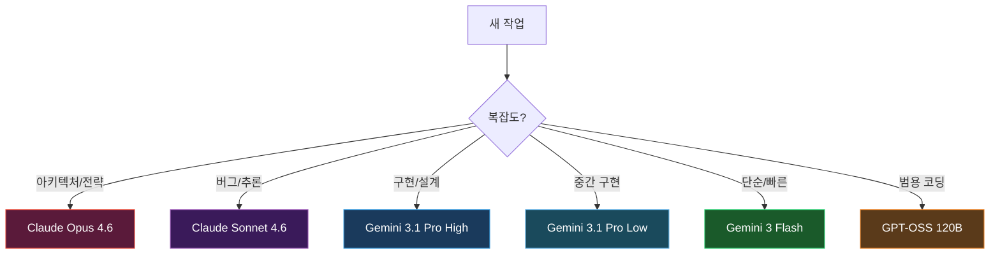
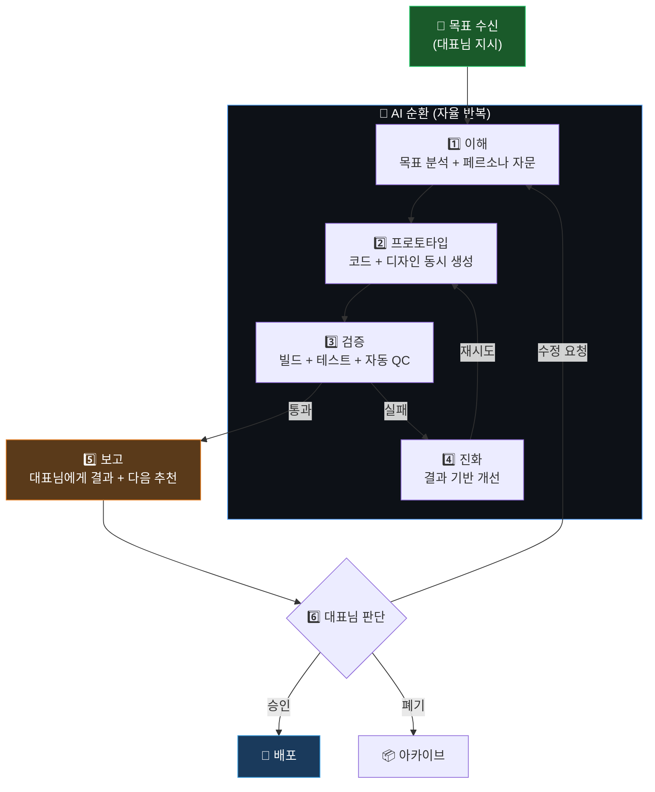

# 🏗️ 뇽죵이 에이전트 v2 — 아키텍처 설계서 (개정판)

> **프로젝트 루트**: `E:\Agent\뇽죵이Agent`
> **핵심 변경**: 대표님 8가지 피드백 전면 반영
> **v1 → v2 핵심 변화**: "인간 방식 19단계" → "AI가 일하기 좋은 순환 6단계"

---

## 0. v1 → v2 변경 일람

| # | 피드백 | v1 | v2 |
|---|--------|----|----|
| 1 | 모델 유연성 | Gemini 3.1 Pro 한정 | **모든 Antigravity 지원 모델** 활용 |
| 2 | 기억 저장소 | SQLite | **Obsidian Vault** (MCP 연동) |
| 3 | Telegram | 포함 | **제거** (직접 AG 명령) |
| 4 | 코드 초안 | Ollama가 작성 | **Antigravity가 작성** |
| 5 | 쉘 | PowerShell | **bash** (Node 명령은 예외 허용) |
| 6 | 로컬 LLM | 바로 사용 | **개별 검증 후 사용** |
| 7 | 기존 자산 | OpenClaw/Empire 참조 | **완전 독립** (폴더 삭제 예정) |
| 8 | 워크플로우 | 인간식 19단계 | **AI 최적 순환 구조 + 페르소나** |

---

## 1. 두뇌-신체 모델 v2

### v1과의 차이

```
v1: 🧠 AG(Gemini만) ↔ 🦾 서버 ↔ 🤖 Ollama(초안 작성)
v2: 🧠 AG(멀티모델) ↔ 🦾 서버 ↔ 🤖 Ollama(보조 의견만)
                     ↕
               📓 Obsidian(영속 기억)
```

### 역할 재정의

| 역할 | v1 | v2 |
|------|----|----|
| **Antigravity** | Gemini 3.1 Pro 고정 | 작업별 최적 모델 선택 |
| **코드 초안** | Ollama | **Antigravity** (중요 작업) |
| **Ollama** | 코드 초안 + 옵션 제시 + 1차 리뷰 | **보조 의견만** (린트, 포맷, 간단 검증) |
| **기억** | SQLite | **Obsidian Vault** |
| **Telegram** | 포함 | **제거** |

---

## 2. 멀티 모델 전략

Antigravity가 지원하는 **모든 모델**을 작업 성격에 따라 사용.

| 모델 | 적합한 작업 | 비용 체감 |
|------|-------------|-----------|
| **Gemini 3.1 Pro (High)** | 복잡한 아키텍처 설계, 대규모 리팩터링 | 💰💰💰 |
| **Gemini 3.1 Pro (Low)** | 중간 구현, 코드 리뷰 | 💰💰 |
| **Gemini 3 Flash** | 단순 작업, 빠른 응답, 상태 확인 | 💰 |
| **Claude Sonnet 4.6 (Thinking)** | 논리적 추론, 복잡한 버그 분석 | 💰💰💰 |
| **Claude Opus 4.6 (Thinking)** | 최고 난이도 설계, 전략적 판단 | 💰💰💰💰 |
| **GPT-OSS 120B (Medium)** | 범용 코딩, 문서 작성 | 💰💰 |

### 모델 선택 기준 (서버가 제안 → Antigravity가 결정)



---

## 3. Obsidian 기억 시스템

### 왜 Obsidian인가? (vs SQLite)

| 항목 | SQLite | Obsidian |
|------|--------|----------|
| **Antigravity 접근** | 별도 MCP 서버 필요 | ✅ **이미 MCP 연결됨** |
| **사람 가독성** | SQL 쿼리 필요 | ✅ **마크다운 직접 열람** |
| **검색** | SQL WHERE | ✅ **전문검색 + 태그 + 링크** |
| **구조** | 스키마 필수 | ✅ **자유 형식** |
| **KI 연동** | 별도 구현 | ✅ **기존 KI 시스템과 동일** |
| **백업** | DB 파일 | ✅ **Git sync 가능** |

### Obsidian Vault 구조

```
Obsidian Vault (기존 볼트에 폴더 추가)
└── 뇽죵이Agent/
    ├── tasks/                    # 태스크 관리
    │   ├── queue.md              #   대기열 (YAML frontmatter)
    │   ├── active.md             #   현재 진행 중
    │   └── archive/              #   완료된 태스크
    │
    ├── personas/                 # 페르소나 라이브러리
    │   ├── _registry.md          #   페르소나 목록
    │   ├── customer-early-adopter.md
    │   ├── philosopher-socrates.md
    │   ├── ceo-startup.md
    │   └── ...
    │
    ├── memory/                   # 에이전트 기억
    │   ├── decisions.md          #   의사결정 이력
    │   ├── lessons-learned.md    #   교훈 기록
    │   └── project-context/      #   프로젝트별 컨텍스트
    │
    └── sessions/                 # 세션 로그
        └── 2026-02-26.md
```

### 서버 ↔ Obsidian 연동

Node.js 서버에서 Obsidian Vault는 **파일시스템의 마크다운 폴더**. `fs.readFile / fs.writeFile`로 직접 접근 가능. YAML frontmatter로 구조화된 데이터도 저장 가능. Antigravity는 기존 Obsidian MCP로 접근.

---

## 4. 🔄 AI 관점 워크플로우 재설계

### 4.1 기존 문제 인식 (대표님 통찰)

> "현재 19단계는 **인간이 일하는 방식**을 따랐다. 하지만 AI가 하는 일이므로:
> - 디자인을 먼저 하는 순서가 맞는지 의문
> - 코딩하면서 디자인이 시시각각 변해야 하는데
> - 컨펌하고 승인 얻고 다시 회의하는 건 AI에게 낭비"

### 4.2 인간 방식 vs AI 방식

| 인간 방식 (현재 19단계) | AI 방식 (제안) |
|---|---|
| 아이디어→검증→설계→디자인→코딩→테스트→배포 | **동시 진행 + 빠른 반복** |
| 각 단계 사이에 승인 게이트 | **결과물 기반 판단** (되면 진행, 안 되면 수정) |
| 디자인 → 승인 → 코딩 → 승인 → ... | **코딩하면서 디자인 동시 진화** |
| 실패 시: 처음으로 돌아가서 재설계 | **실패 지점에서 즉시 수정 후 재시도** |

### 4.3 AI 최적 워크플로우: **순환 6단계**



### 4.4 기존 19단계 → 순환 6단계 매핑

| 순환 단계 | 흡수하는 기존 STEP | 핵심 변화 |
|-----------|-------------------|-----------|
| **1. 이해** | STEP 0(PADA) + 1(환경) + 2(벤치마크) + 3(스택) | 페르소나 자문 추가, 동시 실행 |
| **2. 프로토타입** | STEP 4(디자인) + 5(코딩) | **디자인+코딩 동시** → 분리 안 함 |
| **3. 검증** | STEP 5.5(빌드) + 6(e2e) + 7(QC) + 7.5(CI) | 자동화 100%, 게이트 제거 |
| **4. 진화** | STEP 8(에러수정) + 8.5(디버깅) | 실패 시 즉시 수정 (대표님 승인 불필요) |
| **5. 보고** | STEP 9(리뷰) | 결과물 + 증거 + 다음 추천 |
| **6. 판단** | STEP 4.5(승인) | **유일한 인간 게이트** — 나머지는 AI 자율 |

### 4.5 핵심 원칙: "디자인과 코딩은 동시에"

```
❌ 인간 방식: 디자인 → 승인 → 코딩 → 디자인 수정 → 재승인 → ...
✅ AI 방식:   [코딩 + 디자인] 동시 진행 → 결과물 보고 → 대표님 한 번만 판단
```

- AI는 코딩하면서 UI가 어떻게 나올지를 **즉시** 알 수 있다
- "디자인 먼저"는 인간이 구현 비용을 아끼려고 하는 것 — AI에게 구현 비용은 낮다
- **결과물**(실제 동작하는 프로토타입)로 판단하는 것이 훨씬 효율적

---

## 5. 🎭 페르소나 시스템

### 5.1 설계 철학

> **페르소나 = 스킬처럼 갈아 끼우는 관점 렌즈**
>
> 특히 **고객 페르소나가 PADA에서 빠져 있었던 것**이 핵심 누락.

### 5.2 페르소나 분류 체계

| 카테고리 | 페르소나 예시 | 활용 시점 |
|----------|-------------|-----------|
| **👤 고객** | 얼리어답터, 일반 사용자, 기술혐오자, 시니어 | **이해 단계** — 수요 검증 |
| **🏛️ 철학자** | 소크라테스(질문법), 마키아벨리(현실주의), 장자(무위) | **의사결정** — 다각도 분석 |
| **💼 비즈니스** | 스타트업 CEO, VC 투자자, CFO | **타당성 검증** — 사업성 |
| **🔧 엔지니어** | 시니어 백엔드, 프론트엔드, DevOps, 보안 | **프로토타입** — 기술 검증 |
| **⚖️ 규제** | 개인정보 변호사, 공정거래 전문가, 세무사 | **검증** — 법적 리스크 |
| **🕰️ 시대적** | 2026 AI 시대 사용자, 2020 모바일 네이티브 | **트렌드** — 시대 적합성 |

### 5.3 페르소나 파일 포맷 (Obsidian 마크다운)

```markdown
---
id: customer-early-adopter
name: 얼리어답터 고객
category: customer
era: 2026-현재
activated_at: [이해, 프로토타입, 보고]
priority: critical
---

# 🧑‍💻 얼리어답터 고객

## 성격
- 새로운 기술에 열광하지만 **완성도에는 가차없다**
- 1분 이내에 가치를 못 느끼면 이탈

## 이 페르소나가 묻는 질문
1. "이거 왜 써야 해? 기존 것과 뭐가 달라?"
2. "첫 화면에서 뭘 할 수 있는지 3초 안에 알 수 있어?"
3. "모바일에서도 되나?"
4. "내 데이터는 안전해?"

## 합격 기준
- 온보딩 30초 이내 완료
- 핵심 기능까지 3클릭 이내
```

### 5.4 Ollama 신규 역할: 페르소나 시뮬레이션

이 작업은 **정확도보다 다양성**이 중요 → 로컬 LLM에 적합.

```
Antigravity: "이 UI에 대해 '기술혐오 시니어' 관점에서 평가해"
→ Ollama: "글씨가 너무 작아요. 왜 톱니바퀴 아이콘만 있나요?"
→ Antigravity: 이 피드백 반영하여 접근성 개선 결정
```

---

## 6. 📡 데이터 그라운딩 엔진

> **핵심 원리**: 페르소나 시뮬레이션에서 "이건 추측이야, 팩트가 필요해"를 **AI가 자동 감지** → 실 API 데이터를 호출하여 페르소나 답변에 사실을 주입

### 6.1 자동 감지 트리거

| 페르소나 답변 패턴 | 감지 유형 | 자동 API 호출 |
|-------------------|----------|---------------|
| "시장 규모는 약..." | 🔢 정량 추측 | 통계청 KOSIS API |
| "사용자들은 보통..." | 👥 사용자 행동 | 앱스토어 리뷰 / Reddit |
| "가격은 대략..." | 💰 가격 추측 | 네이버쇼핑 / 쿠팡 검색 |
| "법적으로 문제가..." | ⚖️ 규제 | 법령정보 API |
| "트렌드가..." | 📈 트렌드 | Google Trends / Naver DataLab |
| "경쟁사는..." | 🏢 경쟁사 | 웹 검색 + 크롤링 |
| "정부 사업은..." | 🏛️ 공공 | 나라장터 API (이미 MCP 연결) |

### 6.2 활용 가능 무료 API

| API | 데이터 | 비용 | 일일 한도 |
|-----|--------|------|----------|
| 통계청 KOSIS | 인구/경제/산업 | 무료 | 충분 |
| Google Trends | 검색 트렌드 | 무료 | 비공식 |
| Naver Search | 뉴스/블로그/쇼핑 | 무료 | 25,000/일 |
| 나라장터 | 정부 조달/입찰 | 무료 | 이미 연결 |
| 법령정보 (law.go.kr) | 법률/판례 | 무료 | 충분 |
| Play Store | 앱 리뷰/평점 | 무료 | 스크래핑 |
| data.go.kr | 공공데이터 전반 | 무료 | API별 상이 |

### 6.3 플로우

```
페르소나 응답 → Antigravity 분석 → "가격 추측 감지"
  → MCP: grounding_search({type: "price", query: "재테크 앱 구독료"})
  → 서버: 네이버쇼핑 API 호출 → 실제 가격 데이터 반환
  → Antigravity: 페르소나 응답에 팩트 주입
  → 보고서: "페르소나는 월 5,000원 예상 → 실제 시장가 3,900~9,900원"
```

---

## 7. 서버 모듈 구조 v2

```
E:\Agent\뇽죵이Agent/
├── package.json
├── tsconfig.json
├── .env
├── src/
│   ├── index.ts                  # 진입점
│   ├── mcp-server.ts             # MCP 서버 (AG 연결)
│   ├── core/
│   │   ├── task-manager.ts       #   태스크 관리 (Obsidian)
│   │   ├── obsidian-store.ts     #   Obsidian 읽기/쓰기
│   │   ├── model-selector.ts     #   최적 모델 추천
│   │   └── config.ts
│   ├── personas/
│   │   ├── persona-loader.ts     #   Obsidian에서 로드
│   │   ├── persona-engine.ts     #   상황별 자동 소환
│   │   └── persona-simulator.ts  #   Ollama 시뮬레이션
│   ├── grounding/                # 📡 데이터 그라운딩
│   │   ├── grounding-engine.ts   #   자동 감지 + API 라우팅
│   │   ├── adapters/
│   │   │   ├── kosis.ts          #     통계청 KOSIS
│   │   │   ├── naver-search.ts   #     네이버 검색
│   │   │   ├── google-trends.ts  #     Google Trends
│   │   │   ├── law-kr.ts         #     법령정보
│   │   │   ├── app-reviews.ts    #     앱스토어 리뷰
│   │   │   └── web-scraper.ts    #     범용 웹 스크래핑
│   │   └── fact-injector.ts      #   팩트 → 페르소나 응답 주입
│   ├── workflow/
│   │   ├── understand.ts         #   1. 이해
│   │   ├── prototype.ts          #   2. 프로토타입
│   │   ├── validate.ts           #   3. 검증
│   │   ├── evolve.ts             #   4. 진화
│   │   └── report.ts             #   5. 보고
│   ├── execution/
│   │   ├── git-worktree.ts       #   Git 격리
│   │   ├── shell-runner.ts       #   bash 명령
│   │   └── test-runner.ts        #   테스트 실행
│   ├── advisory/
│   │   ├── ollama-client.ts      #   Ollama API
│   │   └── llm-benchmark.ts      #   모델 검증 도구
│   └── utils/
│       └── logger.ts
├── docs/                         # 분석/설계 문서
└── tests/
```

---

## 8. 구현 로드맵 v2

### Phase 1: 기반 + 검증 (1주)
- [ ] Node.js + TypeScript 프로젝트 초기화 (`E:\Agent\뇽죵이Agent`)
- [ ] MCP 서버 뼈대 (Antigravity 연결 테스트)
- [ ] Obsidian 기억 모듈
- [ ] **Ollama 로컬 LLM 개별 벤치마크**
- [ ] bash 환경 검증

### Phase 2: 핵심 엔진 (1주)
- [ ] 페르소나 시스템 (로더 + 엔진 + 시뮬레이션)
- [ ] AI 순환 워크플로우 6단계
- [ ] 모델 선택 추천 엔진
- [ ] Git Worktree + 쉘 러너
- [ ] 데이터 그라운딩 엔진

### Phase 3: 통합 + 튜닝 (1주)
- [ ] **데이터 그라운딩 엔진** (자동 감지 + API 어댑터 7개)
- [ ] 전체 파이프라인 연동 테스트
- [ ] 페르소나 라이브러리 초기 세트 (5~10개)
- [ ] 성능 최적화 + 에러 핸들링

### Phase 4: 프론트엔드 UI (2주)
- [ ] React + Vite + Tailwind 프로젝트 초기화 (`src/web/`)
- [ ] Empire 디자인 시스템 이식 ("Cute but Efficient" 다크 글래시)
- [ ] 🎮 **픽셀아트 오피스** (PixiJS — Empire에서 그대로 이식)
- [ ] 📋 **칸반 태스크 보드** (AI 순환 6단계에 맞춘 컬럼)
- [ ] 📊 **대시보드** (KPI, 에이전트 활동, 순환 진행률)
- [ ] 🤖 **에이전트 상태 패널** (누가 어떤 단계에서 작업 중)
- [ ] 💬 **채팅 패널** (대표님 ↔ 에이전트 대화 이력)
- [ ] 🖥️ **터미널 패널** (실시간 빌드/테스트 로그)
- [ ] 📨 **의사결정 인박스** (6단계 "판단" 게이트 UI)
- [ ] ⚙️ **설정 패널** (모델 선택, Ollama 상태, API 키 관리)
- [ ] 🎭 **페르소나 라이브러리 뷰어** (앙케이트 결과 시각화)
- [ ] WebSocket 실시간 상태 업데이트
- [ ] 반응형 레이아웃 (사이드바 Shell Layout)

예상 총 기간: **Phase 1~3: 3주 + Phase 4: 2주 = 5주**

---

## 9. 🖥️ 프론트엔드 UI (Phase 4)

### 9.1 Empire에서 이식하는 기능

| Empire 컴포넌트 | 크기 | 이식 방법 | 변경 사항 |
|----------------|------|-----------|-----------|
| **OfficeView** | 13KB | **그대로 이식** | 에이전트 스프라이트는 뇽죵이 맞춤 교체 |
| **TaskBoard** | 12.6KB | 개편 | 칸반 컬럼을 AI 순환 6단계에 맞춤 |
| **Dashboard** | 9KB | 개편 | KPI를 순환 진행률/페르소나 통계로 교체 |
| **AgentStatusPanel** | 21.6KB | 개편 | 멀티 모델 상태 + Ollama 상태 표시 |
| **ChatPanel** | 17.3KB | 개편 | 페르소나 자문 결과도 표시 |
| **TerminalPanel** | 20.2KB | 개편 | 그라운딩 API 호출 로그 추가 |
| **DecisionInboxModal** | 22.2KB | 개편 | 6단계 "판단" 게이트 전용 |
| **SettingsPanel** | 15.4KB | 개편 | 모델 선택/Ollama/API 관리로 확장 |
| **SkillsLibrary** | 6.6KB | 개편 → **페르소나 라이브러리** |
| **ReportHistory** | 12.3KB | 개편 | 순환별 보고서 뷰어 |

### 9.2 칸반 보드 — AI 순환 맞춤 컬럼

```
┌──────────┬──────────┬──────────┬──────────┬──────────┬──────────┐
│ 📥 대기열  │ 🧠 이해   │ ⚡ 프로토  │ ✅ 검증   │ 🔄 진화   │ 📋 보고   │
│          │          │          │          │          │          │
│ [태스크A] │ [태스크B] │          │          │ [태스크C] │          │
│ [태스크D] │          │          │          │          │          │
└──────────┴──────────┴──────────┴──────────┴──────────┴──────────┘
```

### 9.3 기술 스택 (프론트엔드)

| 기술 | 용도 | Empire와 동일? |
|------|------|:-:|
| React 19 | UI 프레임워크 | ✅ |
| Vite 7 | 번들러 | ✅ |
| Tailwind CSS 4 | 스타일링 | ✅ |
| PixiJS 8 | 픽셀아트 오피스 | ✅ |
| Lucide React | 아이콘 | ✅ |
| WebSocket (ws) | 실시간 업데이트 | ✅ |

### 9.4 디자인 톤 유지

Empire의 "Cute but Efficient Empire" 디자인 시스템 그대로 사용:
- **컬러**: `empire-900`(#0f172a) ~ `empire-300`(#cbd5e1)
- **스타일**: 다크 글래시 + `backdrop-blur` + 픽셀아트 `pixelated`
- **애니메이션**: `agent-bounce`, `kpi-pop`, `sparkle-spin`, `shimmer`
- **아이콘**: Lucide React (1.5px~2px stroke)
- **레이아웃**: Shell Layout (사이드바 + 글래시 헤더)

---

## 10. 기존 19단계와의 관계

> **기존 Pre-flight 19단계를 폐기하는 것이 아니다.**
> 19단계의 **지식과 체크포인트**를 AI 순환 6단계 내부에 녹여넣는 것.

기존 19단계의 "체크리스트"는 여전히 유효하되, "순서"와 "게이트"가 변경:
- 순서: 병렬 실행 (디자인+코딩 동시)
- 게이트: 인간 게이트는 [판단] 1개만 (나머지 자동)
