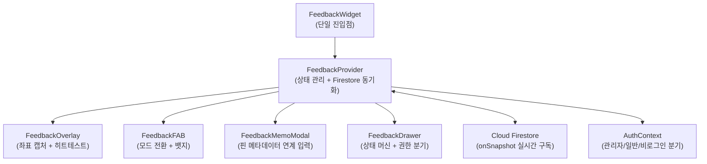

# 인앱 피드백 시스템 기술 명세서 (특허 출원용 초안)

**발명의 명칭**: 웹 애플리케이션 내 좌표 기반 시각적 피드백 수집 및 실시간 동기화 시스템

**출원인**: (주)StayIcon  
**발명일**: 2026년 3월 1일  
**기술 분야**: 웹 애플리케이션 사용자 피드백 자동 수집 및 관리 시스템

---

## 1. 발명의 배경 및 과제

### 1.1 기존 기술의 문제점

| 기존 도구 | 방식 | 문제점 |
|-----------|------|--------|
| **BugHerd** | 브라우저 확장 프로그램 설치 필요 | 사용자에게 별도 설치를 강제 → 피드백 참여율 저하. 모바일 브라우저 미지원 |
| **Userback** | 외부 JavaScript SDK 삽입 + 별도 대시보드 | 피드백 데이터가 제3자 서버에 저장 → 데이터 주권 문제. 자사 DB와 실시간 동기화 불가 |
| **Hotjar** | 히트맵/세션 녹화 | 사용자의 "의도"가 아닌 "행동"만 수집. 구체적 개선 요청을 텍스트로 받을 수 없음 |
| **Google Forms** | 외부 링크 이동 | 앱 컨텍스트(어느 페이지, 어느 요소)가 완전히 유실됨 |

**공통 문제**: 기존 도구들은 ① 외부 의존성(확장 프로그램 또는 별도 서비스) 필수, ② 모바일 터치 UX 미고려, ③ 피드백 지점의 정확한 위치 정보 유실, ④ 앱 내 실시간 상태 반영 불가라는 공통된 한계가 존재함.

### 1.2 Agentation DOM Inspector 참고 및 독자 설계 구분

| 항목 | Agentation 참고 | 본 발명 독자 설계 |
|------|:-----------:|:------------:|
| DOM 요소 위 오버레이 계층 분리 | ✅ | — |
| 인스펙터 모드 ON/OFF 토글 | ✅ | — |
| **좌표 기반(%) 위치 저장** | — | ✅ |
| **모바일 롱프레스(400ms) 인터랙션** | — | ✅ |
| **pointerEvents 토글 히트테스트** | — | ✅ |
| **Firestore 실시간 양방향 동기화** | — | ✅ |
| **낙관적 업데이트(Optimistic Update)** | — | ✅ |
| **탭 전환 시에도 피드백 유지** | — | ✅ |
| **상태 머신(pending→reviewed→resolved)** | — | ✅ |
| **역할 기반 권한 분기(관리자/일반)** | — | ✅ |
| **단일 컴포넌트 삽입(`<FeedbackWidget />`)** | — | ✅ |

> Agentation DOM Inspector는 **CSS Selector 기반**으로 DOM 요소를 식별하지만, SPA(Single Page Application)에서 동적으로 생성/제거되는 요소에 대해 Selector가 무효화되는 문제가 있음. 본 발명은 이를 근본적으로 해결하기 위해 **뷰포트 상대 좌표(%)** 방식을 채택함.

### 1.3 핵심 설계 결정의 이유

1. **"좌표(%) 기반"을 선택한 이유**: CSS Selector는 DOM 구조 변경 시 무효화됨. 반면 좌표(%)는 반응형 레이아웃에서도 시각적 위치를 보존하며, 스크린샷 위에 핀을 겹질 때도 정확한 위치 매핑이 가능함.

2. **"순수 React 컴포넌트"를 선택한 이유**: 브라우저 확장 프로그램은 iOS Safari, Android Chrome 등 모바일 환경에서 동작 불가. 본 발명은 React Context + Portal 패턴으로 **어떤 React 앱이든 `<FeedbackWidget />` 한 줄 삽입**으로 즉시 동작하도록 설계함.

3. **"Firestore 실시간 동기화"를 선택한 이유**: WebSocket 서버를 별도 운영하지 않고도, Cloud Firestore의 `onSnapshot` 구독으로 **서버리스 실시간 양방향 동기화**를 구현. 관리자와 피드백 제출자가 동시에 변경 사항을 확인 가능.

---

## 2. 기술적 구성 (청구항 작성용)

### 2.1 시스템 아키텍처 개요



### 2.2 FeedbackOverlay — 좌표 기반 히트테스트 엔진

**해결하는 기술적 과제**: 투명 오버레이 위에서 사용자가 터치한 지점의 **실제 아래 DOM 요소** 식별 + **뷰포트 상대 좌표(%) 추출**

**기존 방식**: CSS Selector(`document.querySelector`)로 요소를 식별 → DOM 변경 시 무효화  
**본 발명의 방식**: `pointerEvents` 동적 토글 + `document.elementFromPoint()` 조합으로 실시간 히트테스트

#### 핵심 알고리즘

```
[알고리즘 1: pointerEvents 토글 히트테스트]

1. 사용자가 오버레이 위의 좌표 (clientX, clientY)를 터치/클릭
2. 오버레이의 pointerEvents를 "none"으로 설정 (오버레이를 투명화)
3. document.elementFromPoint(clientX, clientY)로 실제 아래 DOM 요소 탐지
4. 오버레이의 pointerEvents를 ""로 복원 (오버레이 재활성화)
5. 탐지된 요소의 textContent를 50자까지 추출 → elementText로 저장
6. 전체 과정은 동기적으로 실행되어 시각적 깜빡임 없음
```

```
[알고리즘 2: 뷰포트 상대 좌표 변환]

1. 오버레이 DOM의 BoundingClientRect를 획득 → (rect.left, rect.top, rect.width, rect.height)
2. 터치 좌표 (clientX, clientY)를 상대 좌표로 변환:
   xPct = ((clientX - rect.left) / rect.width) × 100
   yPct = ((clientY - rect.top) / rect.height) × 100
3. 좌표를 백분율(%)로 저장하여 디바이스 해상도/화면 비율에 독립적으로 동작
```

```
[알고리즘 3: 모바일 롱프레스 감지 (400ms 임계값)]

1. touchStart → 타이머 시작 (400ms)
2. touchMove 발생 → 타이머 취소 (스크롤 의도)
3. 400ms 경과 후 touchEnd 미발생 → 롱프레스 확정
   → 해당 좌표에 시각적 리플 애니메이션 표시
4. touchEnd 발생 → 히트테스트 실행 + 메모 모달 오픈
```

> **400ms 선택 이유**: iOS의 기본 컨텍스트 메뉴 타이머(500ms)보다 100ms 짧게 설정하여 OS 기본 동작과의 충돌을 회피하면서도, 단순 탭(~200ms)과 확실하게 구분 가능.

### 2.3 FeedbackProvider — 실시간 동기화 + 낙관적 업데이트

**해결하는 기술적 과제**: 네트워크 지연 환경에서도 **즉각적 UI 반영** + **서버 정합성 보장**

**기존 방식**: POST 요청 → 서버 응답 대기 → UI 갱신 (지연 체감)  
**본 발명의 방식**: 2단계 비동기 전략

```
[알고리즘 4: 이중 커밋 (Dual-Commit) 전략]

Phase 1 — 낙관적 업데이트 (즉시, 로컬):
  1. 임시 ID 생성: tempId = "temp-" + Date.now()
  2. 로컬 상태 배열 선두에 즉시 삽입 → UI 즉시 반영 (0ms 지연)

Phase 2 — 서버 커밋 (비동기, 백그라운드):
  3. Firestore addDoc()으로 영구 저장
  4. onSnapshot 구독이 새 문서를 감지 → tempId 문서를 실제 Firestore ID로 교체
  5. 실패 시: console.error 로깅만 하고 로컬 상태는 유지 (오프라인 복원력)

결과: 사용자는 피드백 전송 직후 0ms 내에 목록에서 확인 가능
```

```
[알고리즘 5: Firestore onSnapshot 실시간 구독]

1. collection("feedbacks")에 orderBy("createdAt", "desc") 쿼리 생성
2. onSnapshot 리스너 등록 → 컬렉션 변경 시 자동 콜백
3. 콜백 내에서 snap.docs를 Feedback[] 타입으로 매핑 → 전역 상태 갱신
4. 권한 에러 발생 시 → 에러 콜백에서 Mock 데이터 유지 (폴백)
5. 컴포넌트 언마운트 시 → unsubscribe() 호출 (메모리 누수 방지)

특징: 관리자가 상태를 변경하면, 피드백 제출자의 화면에도 실시간으로 반영
```

#### undefined 필드 방어 로직

```
[알고리즘 6: Firestore 호환 문서 구축]

1. 필수 필드를 Record<string, unknown>으로 초기화
2. 조건부 필드 (userEmail, position, elementText)는 값이 존재할 때만 추가:
   if (user?.email) doc.userEmail = user.email
   if (pendingPin) doc.position = { x, y }
   if (pendingPin.text) doc.elementText = text
3. undefined 값이 Firestore에 전송되면 에러 발생 → 이를 원천 차단
```

### 2.4 FeedbackFAB — 인스펙터 모드 전환 UX

**해결하는 기술적 과제**: 일반 앱 사용과 피드백 모드를 **충돌 없이** 전환

**기존 방식**: 별도 페이지/URL로 이동하여 피드백 입력  
**본 발명의 방식**: 플로팅 버튼(FAB)으로 **현재 페이지 컨텍스트를 유지한 채** 3가지 모드를 전환

```
[FAB 상태 전이도]

일반 모드 ──(FAB 클릭)──→ 메뉴 확장 ──(📌 클릭)──→ 인스펙터 모드
    ↑                         │                           │
    │                    (✍️ 클릭)                    (터치 + 메모 전송)
    │                         │                           │
    │                    메모 모달 열림                인스펙터 해제
    │                         │                           │
    └─────────────────────────┴───────────────────────────┘
```

**권한 기반 조건부 렌더링**:
```
if (!user) return null;  // 비로그인 → FAB 자체 미표시
```

### 2.5 FeedbackMemoModal — 핀 메타데이터 연계 입력

**해결하는 기술적 과제**: 피드백 지점의 **시각적 컨텍스트**를 메모와 함께 저장

**기존 방식**: 텍스트만 입력 → "어디가 문제인지" 별도 설명 필요  
**본 발명의 방식**: 핀 좌표 + 자동 캡처된 요소 텍스트를 메모와 함께 번들로 저장

```
[메모 모달 데이터 흐름]

오버레이 터치 → { x: 51.3%, y: 39.1%, text: "카카오톡으로 체크리스..." }
                                    ↓
메모 모달에 자동 표시: "선택한 영역: 카카오톡으로 체크리스..."
                      "위치: (51%, 39%)"
                                    ↓
사용자 메모 입력: "이 버튼 동작 안 함"
                                    ↓
최종 저장 문서: {
  page: "/projects/jinmi/portal/",
  type: "pin",
  memo: "이 버튼 동작 안 함",
  position: { x: 51.3, y: 39.1 },
  elementText: "카카오톡으로 체크리스...",
  status: "pending",
  userId: "axuI6Du...",
  userEmail: "stayicon@gmail.com"
}
```

### 2.6 FeedbackDrawer — 상태 머신 + 관리자 권한 분기

**해결하는 기술적 과제**: 피드백의 **생명주기 관리** + **역할 기반** 접근 제어

**기존 방식**: 이메일로 피드백 수신 → 상태 추적 불가, 처리 여부 확인 불가  
**본 발명의 방식**: 3단계 상태 머신 + Firestore 실시간 업데이트 + 관리자 전용 UI

```
[상태 머신]

  pending (접수) ──→ reviewed (확인) ──→ resolved (반영완료)
       │                                        ↑
       └───────── 바로 반영완료 ─────────────────┘
       (관리자 단축 경로)
```

**3단계 권한 분기**:

| 사용자 유형 | FAB 표시 | 피드백 작성 | 상태 변경 | 기술적 구현 |
|------------|:---:|:---:|:---:|------------|
| 비로그인 | ❌ | ❌ | ❌ | `FeedbackFAB: if (!user) return null` + Firestore rule: `isAuth()` |
| 일반 로그인 | ✅ | ✅ | ❌ | Firestore rule: `allow create: if isAuth()` |
| 관리자 | ✅ | ✅ | ✅ | `AuthContext: ADMIN_EMAILS.includes(email)` + `updateDoc()` |

```
[Firestore Timestamp 역직렬화 — timeAgo 버그 해결]

Firestore Timestamp 객체: { seconds: 1740845880, nanoseconds: 0 }
JavaScript Date.now(): 1740845880000 (밀리초)

기존 코드: timeAgo(fb.createdAt) → createdAt이 Timestamp 객체일 때 NaN → "19773일 전" 표시
수정된 코드:
  if (typeof ts === "number") → ms = ts
  if (ts.seconds exists) → ms = ts.seconds × 1000
```

---

## 3. 선행기술과의 차별점

### 3.1 Agentation DOM Inspector vs 본 발명

| 비교 항목 | Agentation | 본 발명 |
|-----------|-----------|---------|
| **요소 식별** | CSS Selector 기반 | **뷰포트 상대 좌표(%) 기반** |
| **SPA 호환성** | Selector 무효화 빈번 | 좌표는 DOM 변경에 독립적 |
| **탭 전환 시** | 피드백 기록 소멸 | **Firestore 영구 저장 → 탭 전환/앱 재시작 후에도 유지** |
| **데이터 저장** | 세션 메모리 (브라우저 탭) | Cloud Firestore (서버) |
| **피드백 번호** | 세션 리셋 | **글로벌 카운트 유지** (Firestore 문서 수) |
| **모바일 UX** | 데스크톱 마우스 위주 | **모바일 롱프레스(400ms) + 리플 피드백** |

> **독자 설계 근거**: Agentation은 개발자 도구(DevTools)의 보조 기능으로, CSS Selector 정확도에 의존함. 본 발명은 **비개발자 사용자**가 모바일에서 직관적으로 "여기가 이상해요"를 지목할 수 있도록 좌표 기반으로 설계함.

### 3.2 BugHerd vs 본 발명

| 비교 항목 | BugHerd | 본 발명 |
|-----------|---------|---------|
| **설치 방식** | 브라우저 확장 프로그램 | **React 컴포넌트 1줄 삽입** |
| **모바일 지원** | iOS/Android 미지원 | **완전 지원** (터치 이벤트 네이티브 처리) |
| **데이터 저장** | BugHerd 서버 | **자사 Firebase 프로젝트** (데이터 주권 보장) |
| **실시간 동기화** | 폴링 방식 (수초 지연) | **Firestore onSnapshot** (밀리초 단위) |
| **비용** | 월 $39~$229 | Firebase 무료 Tier 내 운용 가능 |

### 3.3 모바일 롱프레스 UX (400ms) 착안 근거

- iOS Human Interface Guidelines: 기본 롱프레스 임계값 500ms
- Android Material Design: 기본 롱프레스 임계값 500ms
- **본 발명**: 400ms로 설정 → OS 기본값보다 100ms 짧아 **OS 컨텍스트 메뉴와 충돌 회피** + 단순 탭(~200ms)과 명확 구분
- 추가 방어: `touchMove` 발생 시 타이머 즉시 취소 → 스크롤 의도와 롱프레스를 정확히 분리

### 3.4 Firestore 실시간 동기화의 독자성

기존 피드백 도구(BugHerd, Userback, Hotjar)는 **REST API + 폴링** 방식으로 서버와 통신함. 본 발명은:

1. **onSnapshot 실시간 구독**: 서버에서 문서 변경 시 클라이언트에 **자동 푸시** (폴링 없음)
2. **낙관적 업데이트**: 네트워크 왕복 시간(RTT) 0ms 체감 → 사용자 경험 극대화
3. **권한 에러 시 Mock 폴백**: 비로그인 상태에서도 데모용 샘플 피드백을 표시
4. **양방향 동기화**: 관리자가 상태를 변경하면 피드백 제출자의 화면에도 즉시 반영

> 이 조합(onSnapshot + Optimistic Update + Mock Fallback)은 기존 피드백 도구에서 확인되지 않는 **본 발명 고유의 구성**.

---

## 4. 구현 중 겪은 기술적 난관과 해결책

### 4.1 오버레이 위 히트테스트 (pointerEvents 토글)

**문제**: 피드백 오버레이(`position: fixed; inset: 0`)가 전체 화면을 덮고 있어, `document.elementFromPoint()`를 호출하면 오버레이 자체만 반환됨.

**기존 접근 불가 이유**: 오버레이를 제거하면 터치 이벤트를 감지할 수 없음. 두 가지 요구(이벤트 감지 + 아래 요소 탐지)가 상충.

**본 발명의 해결**:
```javascript
// 1. 오버레이를 순간적으로 투명화
overlayRef.current.style.pointerEvents = "none";
// 2. 투명화된 상태에서 아래 요소 탐지
const el = document.elementFromPoint(clientX, clientY);
// 3. 즉시 복원
overlayRef.current.style.pointerEvents = "";
```
이 3단계는 **동기적으로** 실행되어 렌더링 프레임 사이에 완료됨 → 사용자에게 시각적 변화 없음.

### 4.2 터치와 클릭 이벤트 충돌

**문제**: 모바일에서 `touchEnd` 후 300ms 내에 `click` 이벤트도 발생 → 핀이 2번 생성될 수 있음.

**본 발명의 해결**: 이벤트 핸들러를 **플랫폼별로 분리** 등록:
```jsx
onTouchStart={isInspectorMode ? handleTouchStart : undefined}
onClick={isInspectorMode ? handleClick : undefined}
```
모바일에서는 `touchStart → touchEnd` 흐름만 사용하고, `handleClick`은 데스크톱 마우스 전용으로 동작. 롱프레스 확정 여부를 `touchHint` 상태로 관리하여 중복 방지.

### 4.3 Firestore 권한 에러 시 Mock 폴백

**문제**: 비로그인 사용자 또는 Firestore 규칙 설정 전 단계에서, `onSnapshot`이 `PERMISSION_DENIED` 에러를 발생시켜 리스너가 해제됨 → 빈 화면.

**기존 접근**: 에러 시 "로그인이 필요합니다" 메시지 표시 → 앱 데모/온보딩 불가능.

**본 발명의 해결**:
```javascript
onSnapshot(q, (snap) => {
  if (!snap.empty) setFeedbacks(snap.docs.map(...));
}, () => {
  // permission error → Mock 데이터 유지 (polback)
  // 초기 state가 MOCK_FEEDBACKS이므로 에러 시에도 UI가 동작
});
```
**설계 철학**: 권한이 없어도 시스템이 **작동하는 것처럼** 보여야 함. 실제 Firestore 연결이 되면 Mock이 자동으로 실데이터로 교체됨.

---

## 5. 활용 시나리오

### 5.1 대상 애플리케이션 유형

본 발명은 **React/Next.js 기반 웹 애플리케이션**에 범용적으로 적용 가능하며, 특히 다음 시나리오에서 효과적:

| 시나리오 | 적용 방법 |
|---------|---------|
| **SaaS 제품 베타 테스트** | 테스터가 실제 앱 화면 위에서 버그/개선점을 즉시 지목 |
| **클라이언트 시안 리뷰** | 디자인 시안을 PWA로 배포 → 클라이언트가 모바일에서 직접 피드백 |
| **사내 도구 개선** | 직원들이 업무 중 불편한 UI를 발견하면 즉시 핀 드롭 |
| **교육/LMS 플랫폼** | 학습자가 교재의 오류나 불명확한 설명을 정확한 위치와 함께 보고 |

### 5.2 "FeedbackWidget 한 줄 삽입" 설계 철학

**배경**: 기존 피드백 도구는 SDK 초기화, 설정 파일, API 키 등록 등 **복수의 설정 단계**가 필요함.

**본 발명의 접근**:
```jsx
// layout.tsx — 전체 앱에 피드백 시스템 활성화
<AuthProvider>
  <FeedbackWidget />   {/* ← 이 한 줄이 전부 */}
  {children}
</AuthProvider>
```

**이것이 가능한 이유**:
1. `FeedbackWidget`이 내부적으로 `FeedbackProvider`(Context) + 4개 서브 컴포넌트를 자동 조립
2. Context가 전역 상태를 관리하므로 어느 페이지에서든 피드백 FAB이 동작
3. Firestore 연결은 `lib/firebase` 초기화를 공유 → 별도 설정 불필요
4. 권한 처리는 기존 `AuthContext`를 활용 → 추가 인증 로직 불필요

---

## 6. 청구항 요약 (변리사 참조용)

> [!IMPORTANT]
> 아래는 변리사에게 전달할 기술적 핵심 요소 요약이며, 법적 청구항 문구는 변리사가 작성해야 합니다.

### 독립항 후보

1. **좌표 기반 시각적 피드백 수집 방법**: 웹 애플리케이션의 뷰포트 위에 투명 오버레이를 배치하고, 사용자의 터치/클릭 좌표를 뷰포트 상대 백분율(%)로 변환하여, 해당 좌표 하부의 DOM 요소 텍스트를 자동 캡처하고, 좌표+텍스트+사용자 메모를 하나의 피드백 문서로 클라우드 데이터베이스에 저장하는 방법.

2. **pointerEvents 토글 히트테스트 방법**: 전면 오버레이 레이어에서 사용자 입력을 감지한 뒤, 해당 오버레이의 pointer-events 속성을 동기적으로 비활성화→요소탐지→재활성화하여, 오버레이 하부의 실제 DOM 요소를 식별하는 방법.

3. **낙관적 업데이트 + 실시간 구독 이중 커밋 시스템**: 피드백 제출 시 (Phase 1) 로컬 상태에 임시 ID로 즉시 삽입하고, (Phase 2) 비동기적으로 서버에 저장한 뒤, 서버의 실시간 구독(onSnapshot)이 영구 ID를 반환하면 임시 문서를 교체하는 이중 커밋 방식.

### 종속항 후보

4. 제1항에 있어서, 모바일 환경에서 400ms 롱프레스 임계값을 사용하여 단순 탭과 피드백 의도를 구분하며, touchMove 발생 시 타이머를 취소하여 스크롤과 롱프레스를 분리하는 방법.

5. 제3항에 있어서, 서버 권한 에러 발생 시 사전 정의된 Mock 데이터로 폴백하여 UI 기능을 유지하는 방법.

6. 제1항의 시스템에 있어서, 피드백 문서에 3단계 상태 머신(pending→reviewed→resolved)을 적용하고, 관리자 이메일 목록에 기반한 역할 확인으로 상태 변경 권한을 분기하는 피드백 생명주기 관리 시스템.

7. 제1항의 시스템을 단일 React 컴포넌트(`<FeedbackWidget />`)로 캡슐화하여, 기존 React 애플리케이션의 레이아웃 파일에 1줄 삽입만으로 전체 피드백 기능을 활성화하는 플러그인 방식의 소프트웨어 아키텍처.

---

*본 문서는 특허 출원을 위한 기술 설명서 초안이며, 법적 효력을 갖는 특허 명세서는 등록 변리사의 검토를 거쳐야 합니다.*
